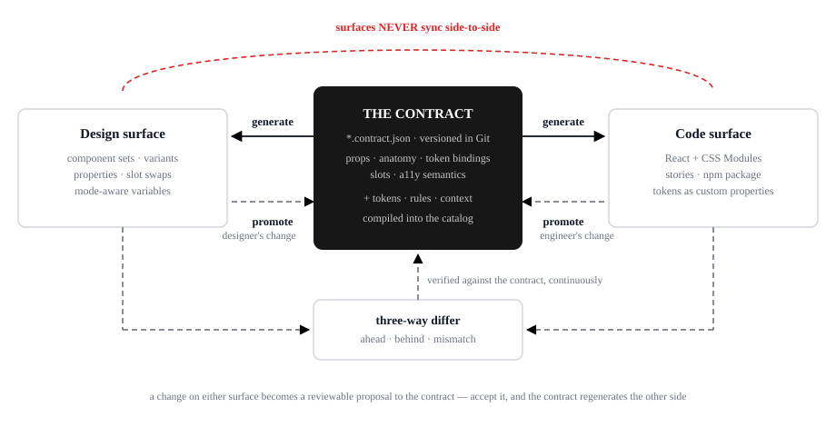

<picture>
  <source media="(prefers-color-scheme: dark)" srcset="docs/assets/logo-dark.svg">
  
</picture>

# Design System Contracts

> **Current state (2026-08-31).** Active plan:
> **[docs/35 — two-journey v1](docs/35-two-journey-v1-plan.md)**. Product
> **v1 is incomplete**; `overallSuccess` stays false (Table keeps its
> existing v32 `true`). This is **not** a ship claim. Both journeys are
> **partially proven**, neither held-out exam is a release gate yet:
> **code→canvas** — reader covers 13×3 boilerplate subjects
> ([review package](recipe/evidence/boilerplate-review-package-v1/));
> **F1 is blocked** (react-day-picker signature thrash —
> [`f1-held-out-v1`](recipe/evidence/f1-held-out-v1/)), not passed.
> **canvas→code** — Button apply-step + held-out AntD Card exam ran with
> silent=0
> ([`canvas-to-code-held-out-v1`](recipe/evidence/canvas-to-code-held-out-v1/receipt.json));
> the docs/26 F-C2C amendment is
> **[adopted 2026-08-31](docs/26-amendment-canvas-to-code.md)**.
> Five signed stays still stand: Button, Input, Combobox, Table, Calendar.
> Version/npm remain owner decisions. Universal-contract Journeys A–C are
> still not the v1 proof. Release bar: [docs/26](docs/26-v1-definition.md).

**A design system's source of truth should be neither the design file nor the code — but a machine-readable *contract* that sits between them and generates both.**

This repository is the working proof, and the candidate reference implementation for a vendor-neutral component contract specification. 56 component contracts and 282 DTCG tokens generate two surfaces — a typed React library and a native design-tool library — that are continuously proven to match the contracts by a three-way differ. Nothing is hand-maintained twice, and nothing pretends to be in sync when it isn't.

**→ Just cloned this and want to see it work? Start with [docs/BETA.md](docs/BETA.md)** — the one journey that is supported end-to-end, with a command list that was run verbatim on a clean machine and a [receipt](parity/receipts/beta/GOLDEN-PATH-RECEIPT.md) showing the artifact reproduces byte-for-byte.

**→ The spec site: [ds-contracts-spec.pages.dev](https://ds-contracts-spec.pages.dev)** · **The playground: [ds-contracts-playground.pages.dev](https://ds-contracts-playground.pages.dev)** · **New here? [Which journey are you on?](#which-journey-are-you-on)**

## What's released vs what's proven

<a id="release-candidate-status"></a>

**The RC heading is retired.** Recipe-IR never shipped as an npm release
candidate. Product **v1 is incomplete**. The active climb is
[docs/35](docs/35-two-journey-v1-plan.md). A version string, a GitHub
prerelease, or `npm i @ds-contracts/cli` is not v1-complete. No new semver
is invented here.

**What would ship vs what is proven (owner decision note):** *Proven in
this tree* — reader + 13×3 review package; canvas→code Button apply-step;
held-out Card exam silent=0; Phase 4 shadcn/Chakra proposed tables; five
signed stays. *Not proven / not shippable as v1* — F1 **blocked**; F-C2C
adopted but does not complete v1; `overallSuccess` false; no recipe npm surface.
Publishing today would ship the pre-pivot `@ds-contracts/*` envelope (or
source-ahead unpublished RCs), not a completed two-journey v1.

| Surface | What it is | What it is not |
|---|---|---|
| **Proven (this repo)** | **Recipe-IR** is the v1 *proof* surface. Five signed stays — Button, Input, Combobox, Table, Calendar. Both journeys **partially** proven (reader 13×3; canvas→code held-out silent=0). Gates: `recipe:button:check`, `recipe:input-field:check`, `recipe:combobox:check`, `recipe:table:check`, `recipe:calendar:check`, plus docs/35 reader / canvas→code checks. Chronology: [docs/32](docs/32-recipe-ir-pivot.md)–[35](docs/35-two-journey-v1-plan.md). | Product v1. `overallSuccess` stays false except Table's v32 pin. F1 is **blocked**. F-C2C is adopted and does not complete v1. |
| **Published npm (`@ds-contracts/*`)** | The **universal-contract** envelope (extract / generate / bundle / onboard). `latest` is the stable line (CLI `0.4.0`, schema `16.0.0`, emitter `0.3.0`). npm `next` still carries older package RCs (CLI `0.5.0-rc.1`, schema `16.1.0-rc.1`, emitter `0.4.0-rc.1`). Use an exact version; do not assume `latest` or `next` is this tree. | Recipe-IR. A v1 proof. A complete product. |
| **This source tree** | Root `package.json` still reads `1.0.0-rc.1`. CLI source is `0.5.0-rc.2`, schema `17.0.0-rc.1` (the `bindings` hoist), emitter `0.4.0-rc.2`, and `@ds-contracts/core` `0.1.0-rc.1` — source-ahead and unpublished. npm publish of a recipe surface is **deferred**. | A published recipe-IR RC. |
| **GitHub releases** | Tags such as `v1.0.0-rc.1` exist. | The recipe-IR pivot. They **predate** merge `4caebfc5b` and still describe the universal-contract RC. |
| **Playground** | The pre-pivot `core/` propose/emit loop, in the browser. | The v1 proof. A recipe-IR demo. |

Publication, tagging, and deploy remain explicit human approvals. The
universal-contract release runbook is still [docs/27 — Release Process](docs/27-release-process.md);
it is **not** a claim that a recipe-IR RC is in flight. Sign-off record:
[RELEASE_CHECKLIST.md](RELEASE_CHECKLIST.md).

**Evaluating the still-shipping universal-contract path? Two documents, and neither is honest alone.**

- **What it does — [docs/24 — What Works](docs/24-what-works.md).** Generated from committed artifacts, every number carrying the file it was read from. The headline: **86.6% mean computed-style equality** for 120 third-party components measured against the original npm package rendering in the same pinned Chromium — exact string match, no tolerance, over 737162 style cells; **92.70% visual fidelity** in the other direction, over the 537 statically scorable variants of a 599-variant Figma kit; and generation that is **deterministic** — the same contract produces byte-identical output on any machine, with 291 generated files hashed against a golden manifest and no model anywhere in the path.
- **What it costs — [docs/23 — Known Limitations](docs/23-known-limitations.md).** The complete inventory of what this tool does *not* do: measured coverage per library, the component classes captured nowhere, what a captured component fails to reproduce, which examples are frozen, and what each gate does and does not measure. It is the longer of the two, deliberately the least flattering document here, and it is the one worth your time before you invest any.

The number that reconciles them is the denominator, which docs/24 prints **before** any mean: 101 of those measured components also carry a committed contract, and those 113 components are **11.1% of the 1015** in the seven libraries with a measured size. (The other three are captured with full receipts and deliberately held, so they count as measured but never as covered — a scorecard is not a shipped stem.) They were picked because they were the tractable ones. Read every percentage above as *"on the easy 11.1%."*

---

## What a contract is

One JSON file per component. It is the file a human edits — the React component and the Figma component set are both generated from it — and it is what design and engineering agree to:

| The contract records | It does **not** record |
|---|---|
| **props** and their legal values | hooks, handlers, business logic |
| **anatomy** — the parts, and how they're laid out | data fetching, side effects |
| **token bindings** — which token paints which channel | anything that only exists at runtime |
| **states** — hover, active, focus-visible, disabled, checked | |
| **semantics** — role, ARIA, declared events | |

The cut is deliberate and permanent: a contract carries only **canvas-expressible facts**, because that is the largest surface on which a deterministic round trip is possible. Your code stays as rich as you like — the contract just never claims to describe that part ([the sync boundary](docs/16-sync-boundary.md)).

```jsonc
// contracts/banner.contract.json (excerpt)
{
  "id": "ds.banner",
  "props": [{
    "name": "status",
    "type": { "enum": ["info", "success", "warning", "error"] },
    "default": "info",
    "bindings": {
      "figma": { "kind": "VARIANT", "property": "Status" },   // → a 4-option variant axis
      "code":  { "prop": "status" }                            // → a typed union prop
    }
  }],
  "anatomy": {
    "root": {
      "tokens": { "background-color": "{color.feedback.{status}.background}" }
      //           → one CSS class per value     → one bound variable per variant
    }
  }
}
```

That one file produces a typed React component **and** a real Figma component set with a Status variant axis whose fills are bound to variables — and a differ can mechanically prove both still match it. Composition (slots with `accepts` constraints, nested component refs), conditional parts (`visibleWhen`), declared events, icon assets, ARIA-by-prop, prop-driven elements and layout, and canvas state previews are all expressed the same way. Full field reference: [the contract specification](docs/02-contract-spec.md).

---

## Which journey are you on?

Three situations bring people here. They are genuinely different amounts of work, so find yours first. **The canonical statement of the three paths — prerequisites, verbs, honest expectations and costs — is [docs/00-choose-your-path.md](docs/00-choose-your-path.md)**; the table below is the summary, and if any page disagrees with that one, that one wins.

| | Your situation | What you actually run | Ends with |
|---|---|---|---|
| **A — design-first** | *"I have a component on the canvas. I want code."* | [Journey A](#journey-a--i-have-a-component-on-the-canvas-i-want-code) — the plugin's **Send** tab, then `generate` | A typed React component + CSS Modules + Storybook stories in your repo |
| **B — code-first** | *"I have components in code. I want them in Figma."* | [Journey B](#journey-b--i-have-components-in-code-i-want-them-in-figma) — a config, a real-browser capture, a bundle, a publish | A designer clicks **Check for updates** and your components appear on their canvas, token-bound |
| **C — reconcile** | *"I already have a mature Figma library **and** a mature codebase."* | [Journey C](#journey-c--i-already-have-both) — scan, reconcile, referee | A property-by-property disagreement report, and a CI gate that keeps it from getting worse |

One rule spans all three: **the surfaces never sync side-to-side.** A designer's change and an engineer's change both travel *through the contract*, as a reviewable diff. Nothing writes to your repo without a pull request, and nothing writes to the canvas without a human clicking Apply.

### What physically crosses each hop

There is no Figma-to-code converter here and no code-to-Figma converter. There is one pure function per direction — one compiles the contract into a Figma script, one proposes a contract from a canvas dump — plus the code emitters, and a set of referees that classify drift against the contract — none of them writes to a surface or picks a side. The contract is the fixed point — every hop reads or writes it — and each hop also carries its own envelope file (code extraction, bundle, generated code, dump, proposal) to or from that fixed point. Every journey above is a path through the same five hops:

| hop | direction | what goes in | what comes out |
|---|---|---|---|
| **1** | code → contract | your `.tsx` / `.css` / custom-elements manifest, via `extract`, `extract --computed`, `promote` | `contracts/*.contract.json` proposals; the computed capture (`extract --computed`) also writes a `*.extension.json` sidecar naming every fact the vocabulary refused, and `promote` carries it forward |
| **2** | contract → canvas | contracts + tokens, via `figma bundle` → one `CONTRACTS-BUNDLE` JSON (with `codeOnlyFacts`) | component sets + variable collections, built by the plugin when a human clicks Apply, each set stamped `ds_contracts/*` |
| **3** | contract → code | contracts + tokens, via `generate --target react\|html\|react-inline\|…` | `<Name>.tsx`, `.module.css`, `index.ts`, `tokens.css` — atomic per contract; `.stories.tsx` only with `--stories` |
| **4** | canvas → proposal | a **dump** (plain JSON of what is drawn: variants, layers, bound variable names, `_provenance`, `_degradations`) from the plugin's Send tab or the REST mapper, run through the propose step (`npm run extract:figma` — *propose* names the step, not a CLI verb) | a `CONTRACT-PROPOSAL` envelope: the proposed contract, its `notes[]`, `unbound[]` rows, child stubs, minted `imported.*` tokens, a provenance line |
| **5** | proposal → contract | the envelope, via a PR, `figma receive --apply`, or copying the JSON | a contract change in `contracts/`, merged by a human or not merged at all |

A fact crossing any hop ends in one of three dispositions — **carried**, **named** in a receipt a person can read, or **refused by name** — and the conformance manifests treat the fourth, silent loss, as a hard failure ([Carried, named, or refused](#carried-named-or-refused), below). The full walk, verb by verb, with three facts traced in both directions, is **[docs/29 — How It Flows](docs/29-how-it-flows.md)**.

---

## Journey A — "I have a component on the canvas; I want code"

The goal: a designer has a component set in Figma; you want a real, typed React component in your repo. *(Design-first — [the canonical path page](docs/00-choose-your-path.md) is the full statement.)*

1. **In the plugin, open the *Send* tab.** Select the set (or find it with *Scan this file*), leave the base-contract box empty if this tool did not build it, and click **Read the set & diff**. The engine reads the live set and proposes a contract from what is actually drawn — variants become props, layers become anatomy, bound variables become token refs. What it reads is a *dump* (plain JSON of what is drawn, with its own `_degradations` — the reader's receipt of what it could not see); where bindings differ across variants without correlating to an axis the proposal records a note and guesses nothing; a raw value with no variable becomes a binding to a provisional `imported.*` token the envelope lists under `mintedTokens` — visible and renamable, never a silent guess (the CLI route, `npm run extract:figma`, mints nothing by default and writes an `unbound` row with nearest-token candidates instead).
   *No plugin?* `npm run extract:figma:rest -- <figma-url>` with a `FIGMA_TOKEN` reads the same sets over REST and writes the same dump shape, with every mapper receipt riding the dump as `_degradations`. One thing that route needs from you: variable **names and modes** come from `/v1/files/:key/variables/local`, which answers only to a token minted with the `file_variables:read` scope — without it every binding degrades to its resolved literal and the CLI says so once, with the fix, instead of calling it a plan limit ([docs/23 §B.25](docs/23-known-limitations.md#b25-the-rest-route-cannot-name-a-variable-binding-without-file_variablesread)).
2. **Get that contract into the repo — with the code already in it.** What leaves the Send tab is a `CONTRACT-PROPOSAL` JSON carrying the proposed contract, its notes, child stubs, minted tokens, and a provenance line: tool-generated, hand-built, or unrecorded. Three doors take it, all reviewable, and **none of them ends at a document nobody can run**. The contract and the component it generates travel together, in the same change:
   - **GitHub PR** — fill in `owner/repo` and a fine-grained token (session-only, never stored; leave *Dry run* ticked to see the exact plan first). The PR carries **both halves**: the contract *and* the emitted component files next to it. Which target it emits is never guessed — `--target` wins, otherwise the `generate` section of `ds-contracts.config.json` decides, and with neither recorded the PR carries the contract alone **and says so in the body**.
   - **Send to repo** — the developer runs `ds-contracts figma receive --out contracts` on their machine, which prints a 6-character code; the designer types it in. Without `--apply` the CLI **writes only the proposal artifact** (`.proposals/<id>.proposal.json`); the contract file is never touched. With `--apply` it writes the contract, and the generated component too, from the same config.
   - **Copy the JSON out** and commit it yourself, then run `generate` (below).
3. **Generate the component** — the explicit form, and what the two doors above run for you:

```bash
ds-contracts generate contracts/button.contract.json --out src/generated \
  --target react --tokens tokens/captured.dtcg.json --stories
```

The CLI twin of the Send tab, for a dump you already have on disk: `npm run extract:figma -- <dump.json> --out <dir>` writes the proposals, `minted.dtcg.json`, `captured.dtcg.json` (the dump's own variables) and `figma-proposals.md`, which prints the exact next `generate` line with every token tree the proposals resolve through.

`--target` accepts `react` (typed TSX + CSS Modules + stories), `html`, `react-inline`, `figma-script`, or any emitter you register with `--emitter`. An unknown target is refused with the list of registered names.

`--tokens` takes DTCG files, **a directory** (every `*.tokens.json` / `*.dtcg.json` inside it), or slot-named entries — `--tokens light=<file>,dark=<file>` — when your token set is layered. Two files that fight over the same token inside one slot are refused by name rather than silently merged, because a light tree merged over a dark one produces a dark component that reports itself as light. `figma bundle` takes the same grammar (since 2026-08-22), so one token layout feeds both surfaces.

Beside the components, `generate` writes **`tokens.css`** — every custom property the components reference, `:root` for the default slot and `[data-theme="dark"]` / `[data-brand=…]` for the named ones — and the emitted `index.ts` and stories import it; a reference the sheet cannot define is refused by name. A contract that fails to parse, validate or emit is refused **by name** (and so is anything composing it) while the rest of the batch is written; a prop or slot named like a DOM attribute (`content`, `title`, `color`) is `Omit<>`-ed from the React base type and named in the file header rather than failing to type-check.

Generation is **fully deterministic**: the same contract produces byte-identical output, every time, on any machine. No model is in the path.

### The honest asymmetry

Every PR states which of these it is, in the body — the tool does not let you find out later.

For a set **this tool generated** (it carries a `ds_contracts/contractId` marker), Journey A is a **true round trip**: re-running the emitters reproduces the component **byte for byte** from the contract in the PR, and this repo's own components re-extract to zero mismatches in both directions. For a **hand-built** set, it is **an inversion**, not a reproduction: real structure, real variants, real bound variables — but a canvas cannot tell you about a `useEffect`, a keyboard handler, or why a value is what it is. **Treat the generated component as a reviewable starting point**, and review it as new code. What one fact looks like on each hop — a Button token that is carried both ways, a ToggleSwitch `translate` that is folded into an anchor and described, an `href` whose value reaches the canvas while its binding does not — is traced in [docs/29's three worked examples](docs/29-how-it-flows.md).

The measured shape of the hand-built claim, on a real kit this project does not own: all 15 Untitled UI sets that were run executed through the set-level fact diff, and the totals across them are **11,400 matched · 1,857 diverged · 7,671 lost · 15,359 invented**.

**Read those four numbers with their context, and do not expect the context to rescue them.** They are 36,287 facts, so matched is **31.4%** — and the claim is *not* that the round trip is lossless, because at 31.4% it plainly is not. The claim is that it **closes**: it ran to completion on 15 of 15 components and every fact landed in exactly one of four named buckets, so a loss is a row in a table rather than an absence. One caveat cuts the other way — the largest single divergence class is an artifact of the comparison, not a loss: **934 of the 954** `layout.mode` divergences are tagged `auto-layout-inert` (a frame whose children are all absolutely placed has no observable auto-layout direction to read back), which changes nothing that is drawn; the remaining 20 are real. The bucket-and-tag accounting, including the untagged remainder it does not explain, is [docs/24 §6.3](docs/24-what-works.md) — and the tagged detail is in [the full report](extract/figma/roundtrip-uui/REPORT.md).

What the *drawing* scores is a separate measurement, and a higher one: the end-to-end proof of this path is [`examples/untitled-ui`](examples/untitled-ui/LEDGER.md) — 15 sets driven through [`uui-pipeline.mts`](examples/untitled-ui/uui-pipeline.mts), pixel fidelity **92.7% mean over 537 scored variants**, per-set 98.0% at best and 81.2% at worst ([docs/24 §4](docs/24-what-works.md)) — and it is exactly what "reviewable starting point" means: a faithful specification, an approximate drawing.

When a contract arrives with no canvas provenance at all (a document straight out of the repo), the PR says exactly that rather than picking a side.

---

## Journey B — "I have components in code; I want them in Figma"

The goal: your real Button, with its real padding, its real colors, and its real variants, as a native Figma component set — built by a machine, not redrawn by a person. *(Code-first — [the canonical path page](docs/00-choose-your-path.md) is the full statement.)*

**There is no copy-paste step and no manual redraw.** There is also, for most libraries, no shortcut: the tool has to *run* your components in a browser to learn what they look like (see [the hard limit](#the-hard-limit-you-cannot-point-this-at-a-github-url), below).

*The one exception:* if your library is React with co-located `*.module.css` files, static extraction can read anatomy and token bindings straight from the stylesheets, and you can go from `extract` to `figma bundle` without a browser at all. Try it first — it costs a minute. If the proposals come back saying *"API surface only"*, you need the capture.

### The path

`acme` stands in for your package name throughout: `examples/acme/…` and
`extract/computed/out/acme` are the paths `onboard` creates for a library called
`acme`, and none of them exist in this repo.

```bash
npm i -g @ds-contracts/cli   # published stable 0.4.0 — universal-contract envelope, not recipe-IR

# ONE command, TWO phases, with a human acknowledgement between them.
ds-contracts onboard @acme/ui          # detect · sandbox · seed · draft · STOP
# …review the draft (below), then:
ds-contracts onboard --continue        # capture · promote · emit · bundle · publish
```

Phase 1 does everything a machine can decide: detects your adapter and styling
method, creates or reuses a pinned sandbox, reads your components' source into
seed contracts, and drafts the capture config. Then it stops and prints exactly
what you have to decide.

**The stop is deliberate, and there is no flag that skips it.** The drafted
capture config carries `__review:*` markers on every field static source
cannot infer — how to mount your component, which classes and CSS-variable
prefixes are yours, which props must be fixed. `onboard --continue` refuses an
unreviewed config **by name** and tells you which fields are still marked.
`--from <stage>` resumes a run over artifacts that already exist; the gate
still runs first, whatever stage you resume from. A capture driven by guessed
mount code measures the wrong thing and reports it with full confidence —
that is the failure this gate exists to prevent.

<details><summary>The individual verbs, if you want to run the steps yourself</summary>

```bash
# 1. Point it at your repo. --detect prefills adapter, root, tokens and styling
#    hints from what it finds — marked "detected", never "confirmed".
ds-contracts init --detect

#    It prints every prefill with the reason it chose that value and writes them
#    into a "$detected" block. Confirm each one, then DELETE that block.

# 2. Read your components' source: props, defaults, events → proposed contracts,
#    plus a DRAFT capture config with "__review:*" markers on every field the
#    tool could not infer.
ds-contracts extract --draft-capture-config
```

</details>

Now **review the draft.** This is the one irreducibly human step. The draft marks four things it cannot guess — `classAllow`, `varPrefix`, `mount`, `fixedProps` — and you answer them by reading your own library. If you skip it, the next command refuses:

```
REFUSED: extract/computed/configs/acme.json is an UNREVIEWED DRAFT capture config
(top-level "__unreviewed-draft" marker). A draft never captures: review every
"__review:*" field (classAllow, varPrefix, mount, stateProps, fixedProps, …),
then delete the marker to approve it.
```

That refusal is the design. A wrong `classAllow` fails *silently* — you get a contract that looks fine and describes the wrong box — so the tool would rather stop. `onboard --continue` re-checks it before anything else runs, including when you resume a later stage; there is no `--yes`.

<details><summary>The individual verbs, continued</summary>

```bash
# 3. The capture. This launches a real Chromium, mounts every prop combination
#    of your real component, and reads the browser's computed styles. It runs
#    the whole sweep TWICE and refuses if the two runs disagree.
ds-contracts extract --computed --config extract/computed/configs/acme.json \
  --harness examples/acme/.acme-sandbox --out extract/computed/out/acme
```

`--harness` is a directory with your library actually installed at a pinned version. That is why this step needs a sandbox: the capture renders your package, it does not read your package's source.

If there is no browser on the machine, this verb — and only this verb — degrades with a named message and **exit code 3**, telling you to `npm i playwright-core && npx playwright-core install chromium` (or point `PLAYWRIGHT_CHROMIUM_PATH` at a Chromium you already have). Every other verb keeps working without a browser.

```bash
# 4. Promote: fuse captured truth into the seed contracts, alias minted leaves
#    back to your library's own token names, probe state previews against the
#    real referee.
ds-contracts promote --config examples/acme/ds-library.json
```

Promotion *used to be* a per-library script you copied and retargeted — six near-identical copies under `examples/*/scripts/`, which is why a fix in one stayed latent in the other five. It is one module now, driven by the per-library `ds-library.json` manifest; Carbon, MUI, Tailwind and Altitude reproduce their committed artifacts byte-for-byte through it. Polaris and Astryx keep their own scripts, by name — see [docs/21 §2.6](docs/21-bring-your-own-design-system.md).

```bash
# 5. One file, containing everything: contracts + your token set + icons.
#    --tokens is the same grammar `generate` uses: two flat files (base, minted),
#    a directory, or layered slot=file entries (primitives=…,semantic=…,brand.<name>=…)
#    with --modes light,dark. Every contract is compiled before ✔ is printed; a
#    refusal is ONE named list, never one per paste.
ds-contracts figma bundle examples/acme/contracts --out acme.bundle.json \
  --tokens examples/acme/tokens/acme.dtcg.json,examples/acme/tokens/acme-minted.dtcg.json \
  --modes light.json,dark.json --name Acme

#    The bundle's `codeOnlyFacts` lists, per contract, every fact the canvas
#    cannot carry — part, kind, channel, value, reason. On the Flowbite eight
#    (examples/tailwind/figma/tailwind.bundle.json) it is 56 facts, and
#    `npm run code-only-facts:check` pins the per-contract counts. The same
#    list prints on stdout, in the plugin run report, and is stamped on each
#    set as `ds_contracts/codeOnlyFacts`. The ToggleSwitch thumb is the worked
#    case: docs/29-how-it-flows.md.

# 6. Mint the standing channel ONCE. It prints two keys: a write key (a CI
#    secret — it publishes) and a read key (sha256 of it — the half you send
#    the designer; it can never publish).
ds-contracts figma claim-channel

# 7. Publish. CI runs this whenever; nobody has to be online.
ds-contracts figma publish acme.bundle.json
```

**8. The designer opens the plugin's *Changes* tab and clicks "Check for updates".** They see what changed in plain words, tick the rows they want, and click **Apply selected**. Applying is in-place: same node ids, same component keys, so instances placed around the file keep their component-property overrides. New components land as new sets. A row whose set has been edited on canvas warns that applying would overwrite that edit, and starts unchecked.

</details>

### Getting the plugin

The Sync Runner plugin is **not on the Figma Community**, and that is a decision rather than a pending task. Distribution is the manifest-upload developer-plugin path, with two real routes to the manifest:

- **No clone:** download the packaged zip the playground serves — [ds-contracts-playground.pages.dev/ds-contracts-sync-runner-plugin.zip](https://ds-contracts-playground.pages.dev/ds-contracts-sync-runner-plugin.zip) — unzip it, and import the `manifest.json` inside the unzipped `ds-contracts-sync-runner/` folder.
- **From a clone:** `npm run plugin:zip` refreshes `figma-sync/plugin-dist/`; import `figma-sync/plugin-dist/manifest.json`. Never import from `figma-sync/plugin/`, which is a stub with no engine (its header reads "engine: NOT INJECTED").

Either way, in the **Figma desktop app** use **Plugins → Development → Import plugin from manifest…**. Development plugins only load in the desktop app, not on figma.com; any plan works and no admin approval is needed. The consequence, stated as a property of the model rather than a task: someone does this once per file owner — and only the clone route requires repo access.

### Two other ways to deliver the same bundle

- **Ad-hoc (both people online).** `ds-contracts figma push acme.bundle.json --code <CODE>` — the designer reads the 6-character code from *Other ways to receive* in the plugin's **Build** tab. Deliver-once, 15-minute TTL, and it carries no ordering, so an out-of-order delivery gets no freshness warning. Use it for a one-off from a laptop.
- **No CLI at all.** The bundle is plain JSON. Send it however you send files; the designer pastes it into the box on the plugin's **Build** tab and clicks *Generate in this file*. This is the whole reason the bundle exists — **JSON is the only thing anyone pastes**, and there is no script step.

### The hard limit: you cannot point this at a GitHub URL

**You cannot give the Figma plugin a repository URL or an npm package name and get components.** Not a missing feature — a structural one:

- The capture must **run** your components in a real browser to read their computed styles. That is what makes the result true instead of guessed.
- A Figma plugin is a sandboxed iframe. No Node, no npm, no bundler, no browser engine of its own. It cannot install your package, and it cannot render it.

So the browser step happens on a machine you control — your laptop or your CI — and what travels to Figma is the finished bundle.

### What the static path does and does not give you

`ds-contracts extract` with no `--computed` runs anywhere, needs no browser, and takes seconds. It reads your source and always proposes schema-valid contracts carrying your **API surface** — props, enums, defaults, events. Whether it also gives you **anatomy** (the parts, their layout, and which token paints each channel) depends entirely on how your library is styled:

| Your library | What static extraction produces |
|---|---|
| React + co-located `<Component>.module.css` | **API surface *and* anatomy** — parts, token bindings, layout, states, read from the stylesheet. Best-effort, not guaranteed: Polaris's whole library yielded anatomy for 109 of 182 components; the rest came back as stubs. |
| React + StyleX | API surface and **structure only** — parts, no styling. Styling is marked as a review item. |
| React + Tailwind, Emotion, styled-components, or any runtime styling | **API surface only.** Anatomy comes back as the stub `{"root": {}}`. |
| Web Components via a Custom Elements Manifest (`cem`) | **API surface only.** A manifest has no styling channel. |

The proposal text tells you which you got, per component: *"API surface AND anatomy … read from source"* versus *"API surface only; anatomy, tokens, and design bindings await reconciliation and human review."*

**Read that last row carefully, because the failure is quiet.** A stub anatomy is schema-valid, so nothing refuses it — and the Figma emitter will happily build the component set anyway. What lands on the canvas is a correctly *named* component with the right variant axes and **blank frames inside**: no fills, no padding, no bound variables. That is not the tool lying to you; it is the tool faithfully rendering a contract that says nothing about what the component looks like. If your canvas sets come out empty, this is why, and the fix is the computed capture.

The static path is still worth running first for any library: it is the seed the capture enumerates against, and it is enough for `ds-contracts diff` to referee your API in CI on day one.

---

## Journey C — "I already have both"

Brownfield: a mature Figma library your team drew by hand, and a mature codebase, and no idea how far apart they are. *(Reconcile — [the canonical path page](docs/00-choose-your-path.md) is the full statement, including the honest cost.)*

- **Look at the Figma side first.** The plugin's **Send → Scan this file** does a read-only pass over every local component set — *including ones this tool never made* — and tells you what is there and which sets could come under contract. Nothing is changed.
- **Get the disagreement report.** `ds-contracts extract --reconcile` compares your code-side contracts against a Figma dump and classifies every property: *agree*, *options-differ*, *code-only*, *design-only*. This is the artifact that ends the "which one is right" argument, because it is per-property and mechanical.
- **Then hold the line.** `ds-contracts diff` is the referee — exit `0` clean, `1` drift (findings named), `2` config error. Wire it into CI and the gap stops growing while you close it.

**What is not supported yet, stated plainly:** the reconciliation phase itself — a merge view, accept-left/accept-right, any tooling that turns the disagreement report into contracts — has **no tooling** ([docs/11's phase table](docs/11-brownfield-adoption.md)); today a human reads the report and hand-writes each contract. And *adopting* an existing set — stamping a hand-built Figma component as contract-backed so future syncs amend it in place — is **not a verb this tool has**. Coexistence inside a foreign kit is proven, and amending a set *this tool created* inside a foreign kit is proven; amending a hand-built set is not. See the non-destructive-sync row in [What this proves](#what-this-proves).

---

## What can I expect?

The two numbers that matter pull in opposite directions, and both are true. Both are measured in [docs/24 — What Works](docs/24-what-works.md), and both are priced in [docs/23 — Known Limitations](docs/23-known-limitations.md):

**Fidelity per captured component is high — 86.6% mean, and every component is listed.** What lands on the canvas is the browser's own computed truth for your real component: not an approximation, not a screenshot, not a guess. Measured against the original npm package rendering, per prop combination × interaction state, as an exact string match with no tolerance and no whitelist, 116 components across nine libraries (the measured capture corpus of [docs/24 §2](docs/24-what-works.md) — shadcn/ui, Fluent 2 and Ant Design are in it, this repo's own library is not) score **86.6% mean computed-style equality** (85.9% cell-weighted over 737,162 cells; 58 of 120 at ≥90%, 93 of 120 at ≥80%). [docs/24 §3.1](docs/24-what-works.md) lists all 120 worst-first, with nothing omitted — the worst is 50.0% (shadcn Avatar, pixel-AA-perfect 12/12; the divergence is channel-string spelling). The capture runs twice and refuses if the runs disagree, which catches uncontrolled state, random ids and animation sampling before any of it reaches a contract.
**Coverage per library is partial, and a first pass will not be your whole library.** Each foreign-library round in this repo committed between 5 and 31 components out of a library of 46 to 243 — the measured per-library coverage runs from about 2% to about 23%, and those 113 components are **11.1% of the 1015** in the seven libraries with a measured size. The per-library table with its denominators is [docs/24 §2](docs/24-what-works.md), printed there *before* any fidelity average for exactly this reason; the source of those denominators is [docs/22 §8.3](docs/22-generality.md). Budget hours per library for the recon and the config, then machine time for the capture.

Beyond that, four properties you can rely on:

- **It refuses rather than guesses.** A token ref outside the inventory, an illegal contract, an unreviewed draft config, a state preview that would render identically to Default — each stops with a message that names the thing. A plausible substituted value is treated as worse than a crash.
- **Everything it cannot carry, it names.** The computed capture (`extract --computed`) writes a `*.extension.json` sidecar listing each captured fact the vocabulary refuses, with the reason, and `promote` carries it forward beside the promoted contracts. Nothing is dropped on the floor.
- **Re-running is always safe.** Same input, same bytes. Applying an update to a live canvas preserves node ids, component keys and component-property overrides on placed instances.
- **The known gaps are written down, not discovered.** Three you will meet soon enough: **overlay components** (Dialog, Menu, Tooltip) have no hover/focus/active planes in the captured truth, so those contracts declare `states: []` by design; **text wrapping is not implemented**, so a hugging text node inside a narrower fixed-width ancestor clips; **webfonts load only where a library's capture config declares them** (per-library `fonts` field, committed font files, no network — Altitude is configured today), so wherever unconfigured absolute text widths are fallback-font widths. **The complete inventory is [Known Limitations](docs/23-known-limitations.md)** — coverage, fidelity, per-library freshness, the journey verbs that don't exist, and what each gate leaves out of its denominator; its counterpart, the measured success side, is [What Works](docs/24-what-works.md). The evidence behind the generality claim, and where it leaks, is [docs/22 §8](docs/22-generality.md).

---

## Try it without cloning

**→ [ds-contracts-playground.pages.dev](https://ds-contracts-playground.pages.dev)**

**Start here if you want to understand the *universal-contract* model before installing anything.** The playground runs the repository's `core/` engine in your browser — no backend, no accounts, no analytics; credentials are session-only and never leave the browser. Ten minutes there teaches that older loop. **It is not the v1 proof surface.** After the recipe-IR pivot, v1 proof is the five live-minted archetypes and their owner grades ([docs/32](docs/32-recipe-ir-pivot.md)); the active climb is [docs/35](docs/35-two-journey-v1-plan.md). The playground still proposes and emits the pre-pivot `*.contract.json` envelope. Do not treat a playground mint or refusal as recipe-IR evidence.

*Try first:* open **Examples**, pick the Badge, then break its contract on purpose — delete a required field, or point a token binding at a name that doesn't exist. The refusal appears on screen, named. That refusal is the whole product.

The playground walks the same two directions as this README, one guided tour each. Most steps run the same `core/` barrel the CLI runs, in your browser, and show the artifact it produced; what cannot run in a browser is labelled on the step itself — the bundle step previews the committed `tailwind.bundle.json`, the adjudication counts are replayed from the committed round-trip receipt (the comparator imports `node:fs`), the envelope is assembled in the shape the plugin exports, and the canvas step is a hand-off (nothing in the browser writes to Figma):

- **Code → Figma** (`?tour=code-to-figma`) — a shipping contract in the governed editor, compiled to a Figma script with its variants, bound variable names and **code-only facts** listed by name; break the contract on purpose and the refusal appears on screen.
- **Figma → code** (`?tour=figma-to-code`) — a real plugin dump (paste your own into the **JSON** tab, or import from a **figma.com URL** with your token), proposed into a contract with its notes and `unbound` rows, then emitted to React and HTML; what the canvas could not say is listed, with its reason.

Code import (a public GitHub file URL, or pasted TSX + CSS Module), your own DTCG tokens, a prompt-to-contract assistant (your key) and ~1 KB permalinks are there too.

**One route is off, and the playground says so on the button:** live relay from the Figma plugin. The plugin's *Send to Playground* tab was removed when its seven tabs were re-housed into Build / Changes / Send, so nothing can answer a pairing code today. Use the figma.com URL route, or paste a dump into the JSON tab. Both credential-gated paths — Figma URL import and prompt-to-contract — are live-verified against real endpoints ([MILESTONES.md](MILESTONES.md)).

Prefer a terminal? The **universal-contract** engine also ships as npm
packages — not recipe-IR; recipe-IR never published as an npm RC. For the
currently published stable CLI, use `npm exec --package=@ds-contracts/cli@0.4.0 --
ds-contracts init`. npm `next` carries CLI `0.5.0-rc.1` (still the pre-pivot
envelope); the source tree is ahead at CLI `0.5.0-rc.2` and unpublished.
Every CLI verb is eval-pinned by a consumer-style smoke test.

## The model

A growing category of tools speaks this vocabulary; this project holds four positions that, together, none of them do. **Bidirectional:** the contract generates *both* the code and the design canvas, and imports from both — round-trips are proven, not promised. **Deterministic:** every artifact is computed from file data and byte-pinned; no LLM guesses in the pipeline (AI is available as an assistant, never as an authority). **Receipted:** anything the pipeline cannot carry is named on screen — a gap is reported, never papered over with a plausible value. **Open:** the schema, the engine, and every instrument that verifies them are in this repository under one permissive license, with no gated tier — because a spec the community can't fully use isn't a spec.

<picture>
  <source media="(prefers-color-scheme: dark)" srcset="docs/assets/contract-flow-dark.svg">
  
</picture>

Every organization that takes design systems seriously eventually splits into two camps. Some come in from the **code side**: the system is an npm package, and the design files are an aging picture of it. Others come in from the **design side**: the system is a canvas library, and the code is an approximation of the pictures. Both camps are answering the same question — *where does the truth live?* — and both answers fail the same way: whichever surface is declared canonical, the other becomes a hand-maintained copy. Copies drift. Drift erodes trust. Eroded trust is why design reviews turn into arguments about which surface is "right."

This project takes a third position: **the source of truth is neither surface.** Each component is defined once, in a small versioned JSON contract capturing everything design and engineering must agree on — props and their legal values, anatomy, token bindings, slot constraints, accessibility semantics, declared events. Both libraries are *renderers* of that contract: generated from it on the first pass, validated against it forever after.

The rule that makes it work: **surfaces never sync side-to-side.** An engineer's new prop and a designer's color change take the same path — flagged by the differ, promoted into the contract as a reviewable diff, then regenerated out to the other surface. One arbiter, version-controlled, no arbitration meetings. It's the governance model that made Git work for code and the DTCG token format work for design tokens, run one level up — at the component-API layer.

### Carried, named, or refused

The contract is not an AI and not a merge algorithm. It adjudicates by doing three things mechanically. **It is the vocabulary:** the schema is the referee on every door, so a fact outside it cannot enter silently. **It fixes the disposition of every fact crossing a hop:** carried (it becomes a field or construct on the other side), named (it cannot cross, so it is written to a receipt with its reason), or refused by name (the conversion stops for that contract and writes nothing for it). **It says which way drift runs — but never who wins:** a human merging a contract PR does that.

Each direction has its own receipt channel for the named facts. Code → canvas: the bundle's `codeOnlyFacts` (part, kind, channel, value, reason), printed by `figma bundle`, listed in the plugin run report, stamped on the set. Canvas → contract: the proposal's `notes[]` and `unbound[]` rows, the dump's `_degradations`, and the round-trip receipt's CANVAS-ABSENT class ([`extract/figma/ROUNDTRIP.md`](extract/figma/ROUNDTRIP.md)). Code → contract: the `*.extension.json` sidecar the computed capture writes and `promote` carries forward ([docs/16](docs/16-sync-boundary.md)). Walls carry `FC-*` codes catalogued in [docs/23](docs/23-known-limitations.md). Silent loss is the forbidden fourth outcome: the conformance manifests are hand-authored denominators, deliberately not derived from the engine's own tables, so a construct that is neither carried nor named-refused is a hard failure rather than an absence ([`conformance/README.md`](conformance/README.md)).

Six instruments classify drift. Four compare **one surface to the contract** (`parity`, `diagnose`, the plugin's **Changes** tab, the ledger); `extract --reconcile` lays the two extractions (code's, the dump's) side by side; the conformance kits hold the engine itself to a hand-authored manifest:

| instrument | compares | classifies as |
|---|---|---|
| `npm run parity` (`parity/diff.ts`) | code ⟷ contract; canvas ⟷ contract; canvas variables ⟷ `tokens/` | `ahead` (propose a patch) · `behind` (regenerate) · `mismatch` (contract is canonical) — [docs/06](docs/06-parity-loop.md) |
| `ds-contracts diff` = `npm run diagnose` (`parity/diagnose.ts`) | contracts ⟷ real library source ⟷ optional design dump | ahead / behind / mismatch with a remedy; exit `0` clean · `1` drift · `2` config error |
| `ds-contracts extract --reconcile` = `npm run reconcile` (`extract/reconcile.ts`) | code extraction ⟷ design dump, per property | `agree` · `options-differ` · `code-only` · `design-only` |
| plugin **Changes** tab (`figma-sync/plugin/code.js`) | the set's stored `canvasFingerprint` vs a fresh one; `specHash` for the code side | `in-sync` · `canvas-edited` · `unstamped` · `fingerprint version changed … NOT a canvas edit`; read-only |
| `sync/ledger.json` + `npm run sync:ledger:check` ([`sync/README.md`](sync/README.md)) | `contractHash` vs disk; the `canvasFingerprint` stamp over REST | `in-sync` · `code-ahead` · `canvas-ahead` · `conflict` · `untracked`; exit `0` / `1` / `2` |
| conformance kits (`npm run conformance`, `conformance:canvas`, `closure:check`) | engine behaviour ⟷ the hand-authored manifest | CARRIED / LOWERED / LEDGERED / REFUSED / UNSUPPORTED, a two-sided ratchet |

All six only classify. The one thing none of them ever does is pick the winner — a human merging a contract PR does that — and none writes to a surface. The verb-by-verb walk of all five hops, with the refusal sentences quoted verbatim, is [docs/29 — How It Flows](docs/29-how-it-flows.md).

There's a second reason, and it's becoming the bigger one: **AI generation.** In this repo's A/B evaluation, an ungoverned agent building screens scored **69/100 adherence with 90 violations** — invented props, hard-coded colors, restyled components. The same model constrained by the compiled contract catalog scored **100/100 with zero violations**, and when it hit a real gap in the system, it *reported the gap* instead of faking around it. The gap became a contract proposal, the proposal became a version bump, and the score went back to 100. The contract isn't just how design and code stay aligned — it's how generation stays honest.

## What this proves

Every capability claim in this repository is backed by an executable check or a committed receipt — that's the house rule ([no capability claim without an eval behind it](CONTRIBUTING.md)). The dated log of what has been proven, in order, is **[MILESTONES.md](MILESTONES.md)**; release history is **[CHANGELOG.md](CHANGELOG.md)**. The standing claims and their mechanisms:

| Claim | Mechanism | Receipt |
|---|---|---|
| **Deterministic generation** | golden-output manifests, byte-compare — determinism proven against recorded output, not just against itself | `evals/golden.json` |
| **Refusal** | illegal contracts fail by name at build time, on both surfaces | C2 eval family |
| **Drift detection** | every claimed drift class has a failing test | C3 eval family |
| **Convergence** | promotion round-trips instead of ping-ponging | C4 eval family |
| **Honest AI generation** | catalog-governed 100/100 vs ungoverned 69/100, scored by a deterministic judge | [docs/10](docs/10-honest-generation.md) |
| **Round-trip identity** | this repo's own generated components re-extracted — code→contract and design→contract — match their shipping contracts with **zero mismatches**, both directions, red-tested | [`extract/ROUNDTRIP-CODE.md`](extract/ROUNDTRIP-CODE.md) · [`extract/figma/ROUNDTRIP.md`](extract/figma/ROUNDTRIP.md) · [`extract/figma/rest/ROUNDTRIP-REST.md`](extract/figma/rest/ROUNDTRIP-REST.md) |
| **Brownfield** | four unrelated design systems — Shoelace, Mantine, Eventz, CBDS — extracted and diagnosed, drift catalogued from real files | [`extract/pilots/`](extract/pilots/) |
| **Enterprise scale** | Carbon, Fluent 2, Spectrum, and Polaris run through the unmodified code-extraction pipeline at pinned SHAs — scores, silent-loss classes found and eliminated, every workaround named | [`extract/pilots/ENTERPRISE-GAUNTLET.md`](extract/pilots/ENTERPRISE-GAUNTLET.md) |
| **Whole-kit census** | every component set in a live enterprise Figma kit (1,618 sets, 76 variant composites) replayed through the full import pipeline — 100.0% clean, facts-carried and degradations counted per set | [`extract/figma/gauntlet/CENSUS.md`](extract/figma/gauntlet/CENSUS.md) · `npm run extract:figma:gauntlet` |
| **Visual parity** | emitted previews perceptually diffed against Figma's own renders (pixelmatch, text-masked score) — a standing worst-first fix queue, cross-renderer deltas named | [`extract/figma/visual-parity/REPORT.md`](extract/figma/visual-parity/REPORT.md) |
| **Non-destructive sync** | in-place amend of live component sets: set key, variant node IDs and property IDs survive repeated passes, so placed instances keep their **component-property** overrides (text, variant, boolean). Two limits, stated: the amend **rebuilds every variant's interior** (`core/emit-figma-script.ts:3958`), so overrides applied to *interior nodes* do not survive — and the only set ever amended inside a foreign kit was one this tool created (`Badge (ds.badge)`); the kit's own hand-built Badge was correctly invisible to the identity gate. **Coexistence in a foreign kit is proven; amending a hand-built set is not** | CBDS pilot forensics ([`extract/pilots/cbds/`](extract/pilots/cbds/)) · [docs/07](docs/07-validation.md) |
| **Theming** | a brand is a token-layer dimension, nothing else — adding one leaves every component byte-identical | `brand-added-token-layer-only` eval |
| **Engine as library** | the whole pipeline is browser-safe pure functions; CLI output golden-guarded through the refactor | `npm run core:browser-check` · [docs/15](docs/15-engine-as-library.md) |
| **Advanced composition, live** | the multi-root composite Modal — a composed Card instance, a repeated Badge collection, real Button instances with applied labels, an inset backdrop — builds correctly on a **real Figma canvas** from one pasted contract (2026-07-22), deterministically, no AI in the conversion; both journey directions gated headless, and both real-Figma quirks found en route (auto-layout hug↔fill collapse, instance property-exposure lag) are modeled in the mock so they fail in Node forever | `npm run plugin:check` (composite pins) · [`docs/handoff/08`](docs/handoff/08-status-what-doesnt-work.md) · `npx tsx scripts/deterministic-roundtrip.mjs` |

All of it is gated by **230 executable checks** (`npm run eval`) that run the real pipeline in a scratch copy — not mocks. They are classified by what they *claim*, and the largest classes after extraction (64) are **detection** (68) and **refusal** (39, now ahead of determinism's 36) — gates that fail if the engine *stops* saying no ([docs/24 §5.1](docs/24-what-works.md)). The measured results those checks protect — fidelity, coverage, the round-trip accounting, and the pins that make each re-derivable — are collected with their denominators in [docs/24 — What Works](docs/24-what-works.md); what they cost is [docs/23 — Known Limitations](docs/23-known-limitations.md).

## What's actually here

| Path | What it is | Edit by hand? |
|---|---|---|
| `contracts/` | **The source of truth.** 56 component contracts — buttons through banners, form fields, chat messages, navigation, progress meters, switches, plus the A3 composition corpus (two-column, sidebar, gallery, bento, page shell). APIs mirror a shipping industry component library ([coverage map](docs/research/astryx-coverage.md)) on this system's own tokens. | ✅ This is where changes happen |
| `tokens/` | 282 DTCG design tokens: primitives → **brand modes** (accent ramp + control radius per brand) → semantic aliases → light/dark mode files. One pipeline compiles them to CSS custom properties *and* design-tool variable collections. Adding a brand touches ONLY this directory — eval-proven. | ✅ |
| `core/` | **The engine as a library** — schema, token corpus, both extraction proposers, and six emitters (`react`, `html`, `react-inline`, `figma-script`, and the opt-in Figma Code Connect pair `code-connect` / `code-connect-html`) behind a pluggable `Emitter` interface. Browser-importable, zero node globals; the CLI scripts are thin shells over it. The part an outside emitter needs — the `Emitter` types and registry, the token resolver, `validateContract`, `generateCss`, the prop classifiers and the prop/DOM collision rule — is the published `packages/core` (`@ds-contracts/core`); the root files are re-export shims over it. | ✅ |
| `src/components/` | The generated React library — typed, accessible, CSF3 stories, publishable package build. | ❌ Generated, never edited |
| `figma-sync/` | Generated, transport-agnostic scripts that build the canvas library — plus the **Sync Runner** dev plugin (`plugin/`) that executes them from disk. A from-blank rebuild of the entire library ran this way and verified clean. | ❌ Generated (`plugin/`, `arrange.js` hand-maintained) |
| `parity/` | The three-way differ: classifies every difference between contract, code, and canvas as *ahead*, *behind*, or *mismatched* — with a proposed remedy. Plus the adherence judge and the brownfield `diagnose` referee. | ✅ |
| `extract/` | Brownfield extraction: code→contract (React/TSX, CSS Modules, Custom Elements Manifest) and design→contract (plugin dump + Figma REST) adapters, plus `computed/` — the real-browser capture floor. The static adapters always propose the API surface, and anatomy + token bindings when the styling method exposes them ([which is which](#what-the-static-path-does-and-does-not-give-you)); the computed floor is what produces browser-observed styling truth. Also the four pilot write-ups and the round-trip receipts. | ✅ |
| `catalog/` + `context/` | The compiled generation constraint (every API + every token + the governance rules) that an AI agent — or a human — can be held to, sharded to fit an agent's context window at any component count, plus the org rules and memory that feed it. | catalog ❌ · rules ✅ |
| `evals/` | 230 deterministic checks on the machinery itself: byte-identical regeneration against golden manifests, refusal of illegal contracts, detection of every claimed drift class, convergence after promotion, extraction round-trips. | ✅ |
| `conformance/` | The **CSS/DOM conformance fixture** — a synthetic library of labelled CSS constructs, mounted through the unmodified capture pipeline, whose expected disposition is declared IN ADVANCE. Every other instrument here derives its denominator from the same filter that decides carriage, so a channel the filter never opened scores 100%; this one does not, which is what makes the frontier *predictable* instead of discovered one library at a time. Generated matrix: [`conformance/EXPECTATIONS.md`](conformance/EXPECTATIONS.md). | ✅ |
| `recipe/` | **The v1 proof surface.** Archetype recipes → Figma-capability IR → named-or-carried receipts. Five live-minted, owner-signed archetypes; product v1 still incomplete (F1). Not exported from any published package. | ✅ |
| `playground/` | The public browser playground ([live](https://ds-contracts-playground.pages.dev)) — a Vite app importing `core/` unmodified. **Pre-pivot:** it still drives the universal-contract path, not recipe-IR. | ✅ |
| `dashboard/` | The **Contract Hub** — a local app visualizing the whole system: live component previews, per-prop binding maps across all three surfaces, token provenance, one-click parity runs, contract editing with regeneration, and the full docs. | ✅ |
| `docs/` | The working documents — start at [Getting Started](docs/00-getting-started.md). | ✅ |

## Working in this repository

*This section is for people who want to run or extend the reference implementation. To use the tool on your own library, the **CLI half** needs no clone — see [the journeys](#which-journey-are-you-on) above; they run on the published `@ds-contracts/cli`. The **plugin half** does need one of two things: download the packaged zip the playground serves at [`/ds-contracts-sync-runner-plugin.zip`](https://ds-contracts-playground.pages.dev/ds-contracts-sync-runner-plugin.zip) and import the `manifest.json` inside it, or clone this repo and run `npm run plugin:zip` ([Getting the plugin](#getting-the-plugin)).*

Requires Node ≥ 20. (Two checks drive a real Chromium — one eval and the visual-parity instrument; if none is found on your machine, the error names the fix: `npx playwright install chromium`, or point `PLAYWRIGHT_CHROMIUM_PATH` at any Chrome/Chromium binary.)

```bash
npm install
npm run build        # tokens → schema → all 56 components, validated against the contracts
npm run dashboard    # the Contract Hub → http://localhost:5180
npm run storybook    # the generated component library
```

Prove the loop to yourself in two minutes:

```bash
npm run parity   # ① code, canvas, and tokens checked against the contracts
# ② edit any contract in contracts/ — add an enum value, change a token binding
npm run build && npm run parity
#    ③ the differ reports exactly what is now behind, and how to fix it
npm run eval     # ④ 230 checks that detection, refusal, and convergence still hold
npm run docs:check # ⑤ every number these docs quote, re-derived from the repo (seconds, no browser)
npm run recipe:pivot-status:check
#    ⑥ recipe-IR status pin (F1 still unmet; do not flip overallSuccess)
#    plus, when you touch an archetype:
#    npm run recipe:button:check
#    npm run recipe:input-field:check
#    npm run recipe:combobox:check
#    npm run recipe:table:check
#    npm run recipe:calendar:check
```

**What step ① actually prints on a fresh clone:** likely *not* an all-green report. The design-side inputs are committed Figma snapshots, and the differ refuses to trust one older than 14 days (`MAX_SNAPSHOT_AGE_DAYS`) — **by design**, because an untouched snapshot would otherwise report green forever. Expect `snapshot-stale` findings naming each old snapshot and its age; contract-vs-code checks still run and should be clean. What `ahead` / `behind` / `mismatch` mean, and which other instruments classify drift, is [the table above](#carried-named-or-refused). That honest red state in step ③ is the product. (Point a token binding at a token that doesn't exist and the *build itself* fails — the contract↔token integrity gate.)

## Bring your own design system

The model isn't specific to these components, React, or any tool — and you can test that claim on **your** library.

**Seven distinct libraries across eight recipe rounds have now gone through this pipeline, and none of them was special-cased in the engine**: this repo's own CSS Modules library, Polaris (CSS Modules), Astryx (StyleX), MUI (Emotion runtime), Flowbite (Tailwind v4 utilities), Carbon (precompiled CSS with theme *class scopes*), and Altitude (Lit web components, **shadow DOM**) — five distinct styling methods. (The "eight libraries" the fidelity numbers above are measured over is a different population — the capture corpus of [docs/24 §2](docs/24-what-works.md), which adds shadcn/ui and Fluent 2 and does not include this repo's own library.) Carbon, the seventh round, was run deliberately as a **control case** for the generality claim: predict "config-only, zero engine changes," then count what it actually cost. The count was **one expression** in `extract/computed/capture.ts`, and it turned out to be a universal bug the other six had tolerated by accident, not a Carbon accommodation ([`examples/carbon/PROVENANCE.md`](examples/carbon/PROVENANCE.md)). Altitude, the eighth, is the honest counterexample: a shadow-DOM library **could not** be a config-only round, and what it cost was one engine file of *general* open-shadow-DOM reader rules — per-root CSSOM collection, host descent, `<slot>` splicing, shadow-walking state drivers — every one of them a no-op where there are no shadow roots, with byte-identity for the other seven proven by re-capture ([`examples/altitude/PROVENANCE.md`](examples/altitude/PROVENANCE.md)).

**→ [docs/21 — Bring Your Own Design System](docs/21-bring-your-own-design-system.md)** is the recipe those seven followed: the nine steps with real commands, the full capture-config reference, and — the honest core — the decision guide for the three things that still take craft (`classAllow`, `varPrefix`, axis-vs-state), each of which fails *silently* when answered wrong. It ends with a section naming where the recipe is genuinely harder than a guide can make it.

No clone required for the static path: the published CLI runs the same extraction in your own repo (`npx @ds-contracts/cli init`, then `npx @ds-contracts/cli extract`) — the [three paths](docs/00-choose-your-path.md) (also walked on [the spec site](https://ds-contracts-spec.pages.dev/get-started/)) cover both directions plus reconciliation, and [`examples/ci/`](examples/ci/) carries the executed-verbatim CI recipes. From this repository, the same code path is:

```bash
npm run extract:code   # your components → schema-valid PROPOSED contracts (API surface always;
                       #   anatomy + token bindings when the styling method allows — see the table above)
npm run reconcile      # → the disagreement report: where your code and design libraries diverge
```

Code-side adapters ship for `react-tsx` (function components, forwardRef/memo, any props-type convention, defaults, `on*` events) with CSS Modules anatomy extraction, and `cem` (**any** library publishing a Custom Elements Manifest: Web Components, Lit, Shoelace-style systems — API surface only, since a manifest carries no styling). Design-side, a component imports from a figma.com URL (`npm run extract:figma:rest`) or a plugin dump. Adapters normalize into one shape, so everything downstream is framework-blind.

Field-tested against four systems this project doesn't own: **Shoelace** (58/58 components, reconciled against its community Figma kit — real kit rot found mechanically), **Mantine** (245 components, 1,691 props, <1s), **Eventz** (a complete brownfield pair: one team's real code library ⇄ its own hand-built design library), and **CBDS** (coexistence and in-place amend inside a foreign enterprise kit) — receipts in [`extract/pilots/`](extract/pilots/). The same unmodified pipeline was then run against **Carbon, Fluent 2, Spectrum, and Polaris** at pinned SHAs — the enterprise gauntlet ([`extract/pilots/ENTERPRISE-GAUNTLET.md`](extract/pilots/ENTERPRISE-GAUNTLET.md)) — which surfaced and then eliminated two silent-loss classes the pilots never hit. Extraction proposes and reports; unbound or raw values are always reported with nearest-token candidates, never invented. Full walkthrough: [docs/13 — Try It With Your Own System](docs/13-try-it-with-your-system.md).

## Toward a specification

The end state this project points at is a vendor-neutral, independently implementable **component contract specification** — doing for the component-API layer what the DTCG spec did for tokens — with this repository as its reference implementation and conformance suite.

That is a claim about the future, so it's held to the same standard as everything else: the **[roadmap](ROADMAP.md)** ([full version](docs/12-roadmap.md)) runs in four phases, each with a **falsifiable exit criterion** — from hardening the loop, through brownfield adoption, to a normative spec draft with a conformance kit, ending at the line that separates a format from a spec: *an implementation this repo's authors didn't write passes the conformance kit.* The schema groundwork — the concrete decisions weighed against A2UI, json-render, CEM, and native design-tool slot semantics, and the normative compatibility rules — is in [docs/08 — Composition & the Road to a Contributable Spec](docs/08-composition-and-spec.md).

## Documentation

**If you are new, read these in this order:** the current-state box at the top of this README (what landed, what is still named) → [docs/35 — The two-journey v1 plan](docs/35-two-journey-v1-plan.md) (the active climb; not a ship claim) → [docs/32 — The recipe/IR pivot](docs/32-recipe-ir-pivot.md) (the v1 proof surface) → [docs/26 — Definition of v1](docs/26-v1-definition.md) (the bar, including the additive recipe-path row) → [Choose Your Path](docs/00-choose-your-path.md) (Journeys A–C on the still-shipping universal-contract path) → [Getting Started](docs/00-getting-started.md) (the five-minute orientation for that path). The playground and docs/29 walk the older envelope; they are not the v1 proof.

**If you are deciding whether to adopt this, read the pair alongside them** — [What Works](docs/24-what-works.md) (everything the tool provably does, each number carrying the artifact it was read from) and [Known Limitations](docs/23-known-limitations.md) (everything it cannot do, in one place, sourced to a measurement). They share a denominator on purpose; either one alone is a sales document.

1. [Choose Your Path](docs/00-choose-your-path.md) · the canonical statement of the three adoption paths — prerequisites, verbs, honest expectations, costs
2. [Getting Started — What, Why, and How](docs/00-getting-started.md) · the five-minute orientation, per-persona usage, and the workflow schematic
3. [The Bridge — Why This Exists](docs/00-the-bridge.md) · the narrative case
4. [Architecture & the Contract Model](docs/01-architecture.md) · generative-first, diagnostic-forever
5. [Contract Specification](docs/02-contract-spec.md) · every field, with examples
6. [Token Pipeline](docs/03-token-pipeline.md) · DTCG dialect, modes, zero-dependency build
7. [Code Generation](docs/04-code-generation.md) · what gets emitted, and how to add a component
8. [The Parity Loop](docs/06-parity-loop.md) · drift detection and the executed both-directions demo
9. [Validation — Claims, Evals, Evidence](docs/07-validation.md) · what's proven and how
10. [Composition & the Road to a Contributable Spec](docs/08-composition-and-spec.md)
11. [Advanced Components — the DataTable Round](docs/09-advanced-components.md) · compound, data-shaped components and the npm package build
12. [Honest Generation](docs/10-honest-generation.md) · the catalog, the deterministic judge, and the 100-vs-69 A/B result
13. [Brownfield Adoption](docs/11-brownfield-adoption.md) · connecting pre-existing design + code libraries — extraction, reconciliation, diagnostic-first
14. [Roadmap](docs/12-roadmap.md) · four phases toward a component contract spec, each with a falsifiable exit criterion
15. [Try It With Your Own System](docs/13-try-it-with-your-system.md) · extraction adapters, the design dump, and the disagreement report
16. [Questions & Objections](docs/14-questions-and-objections.md) · every hard question, asked the skeptic's way, answered with receipts
17. [The Engine Is a Library](docs/15-engine-as-library.md) · pure-function core, pluggable emitters, browser receipts
18. [The Sync Boundary](docs/16-sync-boundary.md) · what a contract carries, what it never will — deterministic core, bounded assist, named gaps
19. [Run the Gauntlet](docs/17-run-the-gauntlet.md) · the to-and-from sequence packaged for an outside tester — commands, expected outcomes, honest gaps
20. [User Flows](docs/18-user-flows.md) · the two disciplines' first hour and daily loop, every step tagged built-or-missing, plus the ranked gap list that drives the build order
21. [Bring Your Own Design System](docs/21-bring-your-own-design-system.md) · the nine-step recipe eight library rounds actually followed, the full capture-config reference, the decision guide for the parts that are still craft, and a troubleshooting table built from real failures
22. [Generality — general engine, or just these libraries?](docs/22-generality.md) · the evidence behind the recipe: the styling-architecture matrix, the cross-library fix record (a defect found via one library repairing another's bytes in the same commit), the adversarial engine audit, and the honest ledger of where the claim leaks
23. [**Known Limitations**](docs/23-known-limitations.md) · half of the adoption-decision pair — what it costs: measured coverage per library, the component classes captured nowhere, what a captured component does not reproduce, which examples are frozen and why, the journey verbs that do not exist, and what every gate leaves out of its denominator
24. [**What Works**](docs/24-what-works.md) · the other half — what it does: the denominator first, then computed-style equality per library and per component (all 120, worst first), canvas→code fidelity, the round-trip fact accounting, and the pins that make each number re-derivable. Generated by `npm run capability:report`; `npm run capability:fresh` refuses if it has gone stale, and one of the 230 evals runs that refusal
25. [Astryx Coverage Map](docs/research/astryx-coverage.md) · every component in a 93-component industry library: mirrored, gap-blocked, or behavior-bounded
26. [Definition of v1](docs/26-v1-definition.md) · the pinned release contract and its exact evidence
27. [Release Process](docs/27-release-process.md) · pre-pivot envelope runbook (coordinated RC build, pack, verify); recipe-IR never shipped as an npm RC
28. [Beta Tester Runbook](docs/28-beta-runbook.md) · the three journeys packaged for someone who has never seen this repo — prerequisites, exact commands, what success looks like, the named limitations each track WILL hit, honest time budgets, and the structured issue forms for reporting
29. [How It Flows](docs/29-how-it-flows.md) · what crosses each of the five hops between Figma and code, carried / named / refused, the six adjudication instruments, and three facts traced both ways
31. [First-pass](docs/31-first-pass.md) · does the documented chain work on the FIRST try, untouched — the no-retry exam, the graded-pair packet, and why first-pass quality is not the same claim as end-state quality
32. [**The recipe/IR pivot**](docs/32-recipe-ir-pivot.md) · current v1 proof surface: archetype recipes, Figma-capability IR, named-or-carried receipts, five live-minted owner-signed archetypes; product v1 still incomplete (F1)
33. [Post-v1 plan](docs/33-post-v1-plan.md) · approved next work (design→code perturbation, day-picker F1 exam, lifecycle hardening). Not a claim that v1 shipped.
34. [The boilerplate hill-climb](docs/34-boilerplate-v1-plan.md) · corpus inventory and honesty constraints remain in force; **sequencing superseded** by docs/35. Product v1 still incomplete
35. [**The two-journey v1 plan**](docs/35-two-journey-v1-plan.md) · **ACTIVE** — reader as mechanical source of truth, canvas→code as a co-equal pillar, both held-out exams gate v1. Not a ship claim. Product v1 still incomplete

## Honesty as a design principle

Not everything is expressible yet, and nothing here pretends otherwise:

- **Behavior is a declared boundary — drawn precisely.** Contracts own API, anatomy, tokens, semantics, and the *interaction surface*: declared events like `onToggle`, whose toggle + ARIA state are generated into code and whose presence the differ verifies. The canvas reflects events as description text — it cannot run behavior, and the docs say so. Everything richer (drag, typeahead, focus trapping) stays a hand-written layer by design, not omission.
- **Every absent component is attributed.** The coverage map accounts for an entire 93-component industry library: mirrored, blocked by a *named* schema gap, or behavior-bounded. Coverage has scaled with schema capability, not hand effort — each new schema feature has unlocked a cluster of components mechanically.
- **Degradation is named, never silent.** Canvas surfaces can't run CSS animations or bind SVG paint to variables, so generated canvas states document their limits; a Figma import on a plan without the variables API reports every unresolved binding by name with nearest-token candidates. Nothing is ever fabricated to look complete.

## Status

**Recipe-IR is the v1 proof surface, and product v1 is still incomplete.** The active climb is [docs/35](docs/35-two-journey-v1-plan.md). Five archetypes (Button, Input, Combobox, Table, Calendar) have stayed live Scratch mints and owner-signed grades; F1 (whole-corpus / unseen-library on the recipe path) is the named blocker. `overallSuccess` is not flipped except Table's existing v32 pin. npm publish of a recipe surface is deferred. The playground and the published CLI still run the pre-pivot universal-contract path.

The older model is still validated end-to-end and running in public: generation into both surfaces, the parity loop executed in both directions with receipts, 230/230 evals — the two long-standing named reds (`mui-figma-genesis`, `child-wider-ratchet-and-script-freshness`) were closed on 2026-08-16, stable schema and CLI releases on the public npm registry, a measured 100-vs-69 governed-generation result, bidirectional anatomy extraction with zero-mismatch round-trip receipts, four brownfield pilots plus an enterprise code gauntlet (Carbon, Fluent 2, Spectrum, Polaris) on systems this project doesn't own, a live enterprise Figma kit censused to 100.0% clean (1,618 sets), a standing pixel-level visual-parity instrument, in-place amend proven forensically on live files, and a launched browser playground running the same `core/` engine — with a companion Figma plugin (Build / Changes / Send) that applies contract bundles to the canvas. Live relay from the plugin into the playground is off; use a figma.com URL or paste a dump. GitHub releases `v1.0.0-rc.1` and earlier **predate the pivot**. npm publish of a recipe surface is deferred. [docs/27](docs/27-release-process.md) remains the universal-contract release runbook, not a claim that a recipe-IR RC is in flight. The reference design-tool integration lives behind a transport-agnostic script boundary (`docs/internal/`) — the contract format itself is tool-agnostic.

- **What has been proven, dated, with receipts:** [MILESTONES.md](MILESTONES.md)
- **What it DOES do, measured — read with the next line, never instead of it:** [docs/24 — What Works](docs/24-what-works.md)
- **What it does NOT do — read before adopting:** [docs/23 — Known Limitations](docs/23-known-limitations.md)
- **Release history:** [CHANGELOG.md](CHANGELOG.md)
- **Where this goes next:** [ROADMAP.md](ROADMAP.md)

## Contributing & license

MIT-licensed ([LICENSE](LICENSE)). Contributions follow one norm above all: [no capability claim without an eval behind it](CONTRIBUTING.md). Skeptical? Good — start with [Questions & Objections](docs/14-questions-and-objections.md).
