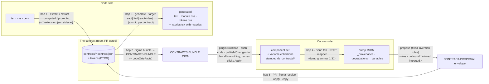
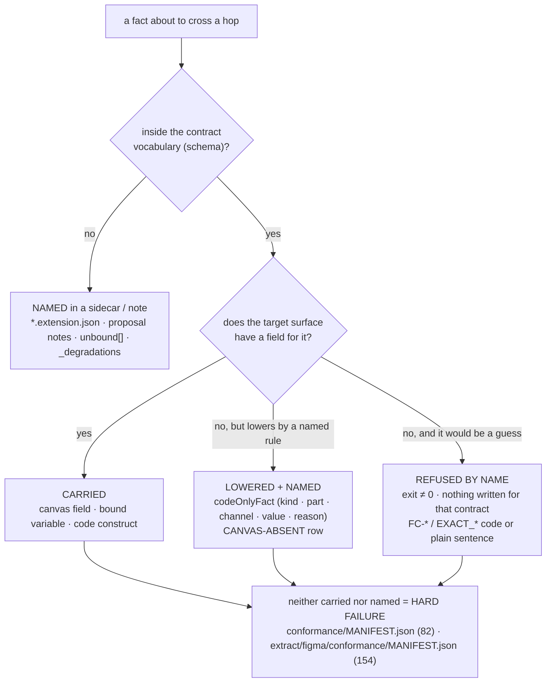
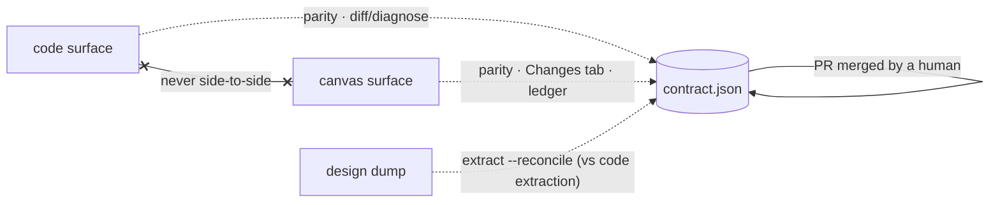

# 29 — How It Flows: Figma ↔ code through contracts

This is the one document that explains, verb by verb and file by file, how a
fact travels from Figma to code and from code to Figma — and why it always
travels *through the contract* and never directly between the two surfaces.
Every `file:line` below points at the working tree; every number is read from
a committed receipt (§7 lists the receipt for each one). The docs site renders
this file at `/how-it-works/flow/` with the engine replays beside it; the
Playground's two guided tours walk the same hops on the same fixtures.

> **Where this sits.** [00 — Choose Your Path](00-choose-your-path.md) tells
> you which situation is yours. [00 — Getting Started](00-getting-started.md)
> is the five-minute orientation. [01 — Architecture](01-architecture.md)
> states the model. This page is the *mechanics* of that model: what
> physically crosses each hop, what is refused, and what is written down.

---

## 0. Glossary

Terms are defined here once and used below without re-definition.

- **contract** — one versioned JSON file per component under `contracts/`
  (schema: `packages/schema`) recording what design and code must agree on:
  props and their legal values, anatomy, token bindings, layout, states, slots,
  semantics, declared events. Both surfaces are *renderers* of it.
- **part** — one named box in `anatomy` (`root`, `label`, `part-0-after`, …);
  a part may carry `tokens`, `literals`, `declared`, `shape`, `attrs`,
  `stylesWhen` / `literalsByProp`.
- **channel** — one CSS longhand on a part (`background-color`, `left`,
  `border-top-color`); the unit the conformance manifests and `codeOnlyFacts`
  count.
- **hop** — one crossing between the contract and a surface. There are five,
  numbered in §1.2; the names are used everywhere in this repo, never "sync".
- **carried / named (ledgered) / refused** — the three dispositions of a fact
  crossing a hop: it becomes a field or construct on the other side; it cannot
  cross but is written to a receipt with its reason; or it stops the
  conversion for that contract *by name* and writes nothing for it. Silent
  loss is the forbidden fourth (`conformance/README.md:40-42`).
- **receipt** — a committed artifact a number is read from: `evals/results.json`,
  `evals/golden.json`, `extract/figma/ROUNDTRIP.md`,
  `examples/tailwind/figma/tailwind.bundle.json`,
  `figma-sync/plugin/engine.receipt.json`, `sync/ledger.json`, the conformance
  manifests. `npm run docs:check` refuses a doc number no receipt produces.
- **wall code (`FC-*`)** — a named limit that appears in source comments,
  refusal messages and [23 — Known Limitations](23-known-limitations.md) so a
  reader can grep for the class. The codes docs/23 cites today are
  `FC-APPLY-TOKENS-NOT-PRUNED`, `FC-DUMP-PROPOSE-PART-STATE-CHANNELS`,
  `FC-DUMP-PROPOSE-UNBOUND-BOOLEAN`, `FC-FONT-SUBSTRATE`,
  `FC-GEOMETRY-EXCLUDED`, `FC-RT-*`. Two greppable reason
  prefixes carry no code: `no canvas field for this literal channel — …`
  (`core/emit-figma-script.ts:2444`) and `pseudo-decor-outside-grammar`
  (`extract/computed/anatomy.ts:2281`). The full census of `FC-*` codes is a
  grep, not a committed receipt, so this page does not quote a count.
- **code-only fact** — a contract fact the canvas cannot carry, receipted per
  contract as `{part, kind, channel, value, reason, variants}` in the bundle,
  on stdout, in the plugin run report, and on the set as
  `ds_contracts/codeOnlyFacts`.
- **bundle (`CONTRACTS-BUNDLE`)** — the one JSON `ds-contracts figma bundle`
  writes: `{type, version: 1, tokenSet, icons?, contracts (raw bytes),
  codeOnlyFacts}`; the plugin Build tab's everyday input.
- **dump** — the plain JSON the plugin Send tab or the REST mapper writes from
  a live set (grammar `1.31` at both producers: `extract/figma/dump.plugin.js:1304`,
  `extract/figma/rest/map.ts:1705`): per-set variants, layers, layout, bound
  variable names, raw values, `propertyDefinitions`, stamps; plus
  `_provenance`, `_degradations`, `_variables`. A fixture is labelled by its
  own `_provenance.dumpVersion`, never by the producer's.
- **propose** — `proposeBatchFromDump` (`core/propose-figma.ts:11182`): dump →
  `{contract, notes[], unbound[], projection, mintedTokens?, childStubs?}` by
  fixed inversion rules; no AI.
- **proposal envelope (`CONTRACT-PROPOSAL`)** — what leaves the plugin Send
  tab: the proposed contract, its notes, child stubs, minted tokens, a
  provenance line (`tool-generated` / `hand-built` / `unrecorded`) and a
  base-freshness verdict (`figma-sync/plugin/engine/entry.ts:2029-2070`).
- **promote** — fuse computed-capture artifacts into promoted contracts plus a
  source-aliased minted token tree; refuses the whole promotion if any
  `{imported.*}` ref fails to resolve (`packages/cli/src/promote.ts:28-29`).
- **minted `imported.*` token** — a provisional DTCG token minted for a raw
  value with no variable or token match; visible, renamable, never silently
  assigned.
- **stamp / fingerprint / specHash** — shared plugin data a built set carries
  (`ds_contracts/*`): identity (`contractId`, `version`), the contract's
  `specHash`, and a `canvasFingerprint` over authored facts
  (`core/canvas-fingerprint.ts`) that the Changes tab re-computes.
- **degradation** — a reader's own named gap (a `_degradations` row: code,
  node path, message) — the dump saying what it could not see.
- **CANVAS-ABSENT** — `extract/figma/ROUNDTRIP.md`'s class for a contract fact
  the canvas cannot express (semantics, a11y, events, effective font
  weight/family); each listed with a reason.
- **diagnose** — `ds-contracts diff` / `npm run diagnose`: contracts vs real
  source (vs an optional dump); ahead / behind / mismatch; exit 0 / 1 / 2.
- **sync** — in this repo, never a verb that writes both sides.
  `sync/ledger.json` records, per contract,
  `in-sync | code-ahead | canvas-ahead | conflict | untracked`;
  `sync:observe / pull / spine` produce PR-shaped bundles and never apply.

---

## 1. The thesis, and one shape for every hop

### 1.1 There is no converter

There is no Figma-to-code converter in this repository and no code-to-Figma
converter. There is one pure function per direction — one that compiles the
contract toward the canvas, one that proposes a contract from a canvas dump —
plus the code emitters, three shapes named below, and a set of referees that
compare each surface to the contract and never to each other. The contract is the fixed point — every hop reads or writes it — and each hop also carries its own envelope file (code extraction, bundle, generated code, dump, proposal) to or from that fixed point.

- `core/emit-figma-script.ts` compiles a contract into a Figma Plugin-API
  script. The plugin runs the same engine, esbuild-bundled
  (`figma-sync/plugin/engine/entry.ts`; receipt
  `figma-sync/plugin/engine.receipt.json`; gate `npm run plugin:check`).
- `core/propose-figma.ts` takes a node-tree dump of a component set and
  proposes a contract.
- `core/emit-react.ts` and its siblings emit code from the contract.

The canvas and the codebase never see each other; each sees only the contract,
and a change on either side is a proposal *to the contract*, merged as a pull
request or not merged at all (`README.md:95`; [01 — Architecture](01-architecture.md)).
Every fact that crosses a hop ends in one of three dispositions — **carried**,
**named** (written to a receipt a person can read), or **refused by name** —
and the conformance manifests treat the fourth outcome, silent loss, as a hard
failure (`conformance/README.md:40-42`; `accuracy/grammar.json:33-55`). No
tool picks a winner; a human merging a contract PR does.

### 1.2 One shape, five hops

The five hops. This table is the naming source; [BETA.md](BETA.md) agrees
where it already numbers (`hop-2`, `hop-4`):

| hop | from → to | verb(s) |
|---|---|---|
| **1** | code → contract | `extract`, `extract --computed`, `promote` |
| **2** | contract → bundle → canvas | `figma bundle`, then the plugin's Build tab / `figma push` / `figma publish` + **Apply** |
| **3** | contract → code | `generate --target react\|html\|react-inline\|…` |
| **4** | canvas (dump) → proposal | plugin Send tab or `extract:figma:rest`, then `propose` |
| **5** | proposal → contract | a PR, `figma receive --apply`, or copy |

Use these five names everywhere. "Sync" is not one of them.

---

## 2. Code → Figma (hops 1 and 2), verb by verb

| hop | verb | reads | writes | refuses by name |
|---|---|---|---|---|
| 1 | `ds-contracts extract [config] [--draft-capture-config]` (`packages/cli/src/cli.ts:58-62`) | `ds-contracts.config.json` + source via `react-tsx` \| `cem` | `<out>/code-extraction.json`, `<out>/contracts/*.contract.json` (schema-valid proposals), `<out>/proposals.md`, a DRAFT capture config with `__review:*` markers | every later verb refuses an unreviewed draft config; "there is no flag that skips the gate" (`cli.ts:46-49`) |
| 1 | `ds-contracts extract --computed --config <capture.json> [--harness <dir>] [--out <dir>]` (`cli.ts:64-65`) | capture config + a sandbox with the library installed + Chromium | `extract/computed/out/<component>/` (capture, fuse, replay, scorecard) + `*.extension.json` — every captured fact the vocabulary refuses, with its reason ([16 — The Sync Boundary](16-sync-boundary.md)) | exit 3 when playwright-core / Chromium is missing; non-carryable transforms refused `pseudo-decor-outside-grammar` (`extract/computed/anatomy.ts:2281`) |
| 1 | `ds-contracts promote --config <ds-library.json>` (`cli.ts:50-53`) | enriched contracts + minted tree | promoted contracts, `*-minted.dtcg.json` (source-aliased), `*.anchors.json` | the WHOLE promotion if any `{imported.*}` ref or alias fails to resolve (`packages/cli/src/promote.ts:28-29`) |
| 2 | `ds-contracts figma bundle <contracts..> --out <file> --tokens <base[,minted]> \| <dir> \| slot=file,… [--modes] [--name] [--icons]` | contract files as RAW bytes + token set + icon SVGs | ONE `CONTRACTS-BUNDLE` JSON `{type, version: 1, tokenSet, icons?, contracts, codeOnlyFacts}` (`packages/cli/src/commands/figma.ts:639-646`); stdout lists every code-only fact per contract | missing provenance (`figma.ts:387-391`); drawable-empty anatomy (`:393`); any contract that does not compile against this token set — ONE list, nothing written (`:617-618`, quoted in §4.3) |
| 2 | plugin **Build** tab (paste) · `figma push <bundle> --code <CODE>` · `figma claim-channel` + `figma publish` → **Changes** tab "Check for updates" → **Apply selected** | bundle | component sets + variable collections; each set stamped `ds_contracts/{contractId, specHash, version, canvasFingerprint, canvasSnapshot, canvasSetSnapshot, codeOnlyFacts, semantics}` — all eight keys written by the compiled script (`core/emit-figma-script.ts`); the drift check at `figma-sync/plugin/code.js:496-611` reads back five of them: `contractId`, `specHash`, `canvasFingerprint`, `canvasSnapshot`, `canvasSetSnapshot` | `planGenerate` validates every contract; all-or-nothing (`entry.ts:922`, quoted in §4.3) |
| 2 (developer route) | `npm run figma:plan` / `ds-contracts generate --target figma-script` (`core/emitter.ts:92-109` registers `figma-script` beside `react`) | contracts + tokens | `figma-sync/01-tokens.js`, `figma-sync/NN-<name>.js` (byte-pinned by `evals/golden.json`) → plugin **Advanced → Paste a script** | — ; the plugin's everyday door is Build (`playground/src/components/HelpDrawer.tsx:92-99`) |

**What the compile produces per contract** (`core/emit-figma-script.ts`):

- `variants[]` of node specs — the cartesian product of the enum axes, plus
  `State=…` preview variants when `bindings.figma.statePreviews` is on;
- bindings as slash variable names — `dotPath.split('.').join('/')` (`:874`);
- `textProps[]` — text props no node binds (`:5081`);
- `codeOnlyFacts[]` — one row per distinct
  `{part, kind: channel|declared|gradient|shadow|event|meter|scrim|preview, channel, value, reason, variants{count, of}}`
  (`:482-490`).

The token → canvas-field lowering is one switch (`:1907-1935`):
`background` / `background-color` → `fill`; `border-color` → `stroke`;
per-side border colours that disagree → `miss(...)`, named (`:1935`). A
literal with no px-shaped canvas field → `literalMiss`, whose reason always
opens `no canvas field for this literal channel — …` (`:2438-2447`). The facts
are stamped on the set as `ds_contracts/codeOnlyFacts` (`:7356`) and listed in
the plugin run report (`figma-sync/plugin/ui.html:876-890`). On the Flowbite
eight the bundle carries 56 facts, and `npm run code-only-facts:check` (a
`maintain` step) refuses if any per-contract count moves
(`core/code-only-facts-check.ts:53-72`).

<!-- site:replay:compile -->

---

## 3. Figma → code (hops 4, 5 and 3), verb by verb

| hop | verb | reads | writes | refuses by name |
|---|---|---|---|---|
| 4 | plugin **Send** tab → "Read the set & diff" (runs the verbatim copy of `extract/figma/dump.plugin.js`; `dumpVersion: '1.31'` at `:1304`) · or `npm run extract:figma:rest -- <figma-url>` with `FIGMA_TOKEN` (`REST_DUMP_VERSION = '1.31'`, `extract/figma/rest/map.ts:1705`) | the live set / REST nodes | dump JSON: per set `{setName, type, nodeId, key, variants[{name, variantProperties, layout, bound, children…}], propertyDefinitions, semantics, contractId, specHash, version…}` + `_provenance{fileKey, dumpVersion}`, `_degradations[]`, `_variables` | the reader's own gaps ride as `_degradations` rows via `degrade(code, nodePath, message)` (`dump.plugin.js:307`, `:363`, `:371`); the REST route names a refused variables endpoint BY CAUSE (`extract/figma/rest/cli.ts:9-14`) |
| 4 | `npm run extract:figma -- <dump.json> [--out dir] [--contracts dir] [--tokens a,b] [--reviewable-inversion]` (`extract/figma/propose.ts`) | dump + token corpus + in-scope contracts matched by `bindings.figma.anchors.componentSetKey` first, name second (`:184-200`) | `<out>/<slug>.contract.proposed.json`, `<out>/<stub>.stub.contract.proposed.json`, `<out>/minted.dtcg.json`, `<out>/captured.dtcg.json` (the dump's `_variables`; `FC-DUMP-PROPOSE-CAPTURED-VARIABLES-DROPPED` closed at `:405`), `<out>/figma-proposals.md` with notes + unbound + the EXACT next `generate` line (`:432-436`) | any skipped set → `process.exit(2)`, no artifacts (`:317`) |
| 4 | plugin Send → `proposeDiff` (`figma-sync/plugin/engine/entry.ts`) | dump + optional base contract + tokenSet | `CONTRACT-PROPOSAL` envelope `{type, baseContractId, baseVersion, setName, summary, proposedContract, projection, proposalNotes, childStubs?, mintedTokens?, provenance{toolGenerated, kind, note}, baseFreshness}` (`entry.ts:2029-2070`) | projection = `exact` when structured `propertyDefinitions` exist or provenance is unrecorded, else `reviewable-inversion` (`:1970-1975`); a stale base → the G3 guard line leads the summary |
| 5 | `ds-contracts figma receive --out <contracts-dir> [--apply]` · `ds-contracts propose-pr <file> --repo o/n [--target t] [--dry-run]` · copy the JSON | envelope | without `--apply`: **only** `<out>/.proposals/<id>.proposal.json` — the contract file is never touched (`figma.ts:44-46`, `:1434`); with `--apply`: the contract + childStubs + minted tree + generated code from the config's `generate` block; `propose-pr` opens one PR with the contract and the emitted component, target never guessed (`propose-pr.ts:36-39`) | a malformed envelope is refused by `parseProposal` (`figma.ts:1050`) |
| 3 | `ds-contracts generate <contracts..> --out <dir> [--target react\|html\|react-inline\|figma-script\|code-connect\|<registered>] [--stories] --tokens <corpus,captured.dtcg.json,minted.dtcg.json>` | proposed contracts + stubs + every token tree their refs resolve through | `<Name>.tsx`, `.module.css`, `index.ts`, `tokens.css` — and `.stories.tsx` only when `--stories` is passed (`packages/cli/src/commands/generate.ts:89`) | ATOMIC PER CONTRACT: a contract that fails to parse / validate / emit leaves no file and anything composing it is refused too (`scripts/generate-components.ts:22-25`, quoted in §4.3); a `var(--x)` referenced by any `.css` / `.css.ts` / `.html` and undefined in `tokens.css` → `CliUsageError` (`packages/cli/src/commands/generate.ts:179-199`) |

**The inversion is a catalogue of fixed rules**, each the inverse of a
documented generator rule (`extract/figma/propose.ts:11-118`: LAYOUT, TOKENS,
ENUM SUBST, TEXT, PROPS, SLOTS, COMPOSITION, ARTIFACTS, SPACERS, UNBOUND). The
one to remember is ENUM SUBST: when the same node binds different slash names
across an axis's variants and the names differ in exactly one segment equal to
the variant value, the proposer writes `{color.action.{variant}.background}`;
anything else becomes the note
`bindings differ across variants without correlating to any variant axis: …`
(`core/propose-figma.ts:1035`) — never a guess. A raw hex with no variable is
an `unbound[]` row with nearest-token candidates, or — with minting on — a
provisional `imported.*` token the reader can see and rename. Projection
`exact` refuses by a stable code: one of the 13 `EXACT_*` codes receipted in
`accuracy/grammar.json` (`EXACT_DEFINITIONS_MISSING` …
`EXACT_PROJECTION_COUNT_MISMATCH`, all thrown by `core/exact-projection.ts`),
or the one code outside that receipt — `EXACT_SEMANTIC_PROJECTION_AMBIGUOUS`,
which only `core/propose-figma.ts` throws (`:1101`, `:1239`) when promoting a
variant axis to semantics would change the authoritative variant projection.
`core/propose-figma.ts` itself throws exactly two codes:
`EXACT_DEFINITIONS_MISSING` (`:1160`) and that unreceipted 14th
(`npm run playground:flow-check` pins both directions of this sentence);
`reviewable-inversion` proposes anyway and stamps
the projection `legacy-unverified` (`core/propose-figma.ts:1075`, `:1161`).

<!-- site:replay:roundtrip -->

---

## 4. How the contract adjudicates — three dispositions, six instruments, one human

The contract is not an AI and not a merge algorithm. It decides three things
mechanically.

### 4.1 The vocabulary

The schema is the referee on every door; a fact outside it cannot enter
silently. Code-side overflow lands in `*.extension.json` with a reason
([16 — The Sync Boundary](16-sync-boundary.md)); canvas-side overflow lands in
proposal `notes[]` / `unbound[]` / dump `_degradations`.

### 4.2 The disposition of every fact in a hop

Carried, lowered by a named rule, or refused by name. The conformance
manifests are hand-authored denominators, "deliberately not derived" from the
engine's own tables, so that "a construct that is neither carried nor
named-refused is a hard failure rather than an absence"
(`conformance/README.md:36-42`). The manifest labels map onto the three
dispositions: CARRIED is carried; LOWERED and LEDGERED are the named middle
(a named rule lowers the fact and a receipt carries the residue); REFUSED is
refused by name; UNSUPPORTED is the CSS/DOM manifest's label for a construct
pinned outside the vocabulary — a named refusal at the frontier, still
counted in the denominator. Pinned in `accuracy/grammar.json:33-55`: the
CSS / DOM frontier is 82 cases (CARRIED 42 · LOWERED 4 · REFUSED 18 ·
UNSUPPORTED 18); the canvas-construct fixture is 154 cases (CARRIED 107 ·
LEDGERED 38 · REFUSED 9).

### 4.3 The three refusal sentences, verbatim

These are the strings the tools print. The site slices them from source at
build time; here they are quoted.

- Hop 2, `figma bundle` (`packages/cli/src/commands/figma.ts:617-618`):
  `✘ Refused — N of M contract(s) do not compile against this token set; the plugin would refuse each of them on paste, so nothing was written:`
- Hop 2, the plugin's plan (`figma-sync/plugin/engine/entry.ts:922`):
  `N of M contract(s) refused — nothing was planned; every refusal is listed below.`
- Hop 3, `generate` (`scripts/generate-components.ts:22-25`): "a contract that
  fails to parse, validate, or emit is REFUSED BY NAME and leaves no file; every
  contract that validates is generated; a contract depending on a refused one
  is refused too".

<!-- site:replay:refusals -->

### 4.4 The direction of drift — but never the winner

Six instruments. Four compare ONE surface to the contract (`parity`,
`diff`/`diagnose`, the **Changes** tab, the ledger); `extract --reconcile`
lays the two extractions (code's, the dump's) side by side, property by
property; the conformance kits hold the engine itself to a hand-authored
manifest. All six only classify. The one thing none of them ever does is pick
the winner — and none writes to a surface:

| instrument | compares | classifies as | never compares |
|---|---|---|---|
| `npm run parity` (`parity/diff.ts`) | code ⟷ contract; canvas ⟷ contract; canvas variables ⟷ `tokens/` | `ahead` (propose a patch) · `behind` (regenerate) · `mismatch` (contract canonical) — [06 — The Parity Loop](06-parity-loop.md) | surfaces to each other |
| `ds-contracts diff [config]` = `npm run diagnose` (`parity/diagnose.ts`) | contracts ⟷ real library source ⟷ optional design dump | ahead / behind / mismatch with a remedy; exit 0 clean · 1 drift · 2 config error | — |
| `ds-contracts extract --reconcile` = `npm run reconcile` (`extract/reconcile.ts:124-127`) | code extraction ⟷ design dump | `agree` · `options-differ` · `code-only` · `design-only` | — (path C's verb; the phase after it has no tooling) |
| plugin **Changes** tab `check-drift` (`figma-sync/plugin/code.js:523-528`) | stored `canvasFingerprint` vs fresh; `specHash` for the code side | `in-sync` · `canvas-edited` · `unstamped` · `fingerprint version changed … NOT a canvas edit` | read-only; never writes the document |
| `sync/ledger.json` + `npm run sync:ledger:check` (`sync/README.md:100-104`) | `contractHash` vs disk; the `canvasFingerprint` stamp over REST | `in-sync` · `code-ahead` · `canvas-ahead` · `conflict` · `untracked`; exit 0 / 1 / 2 | — |
| conformance kits (`npm run conformance`, `conformance:canvas`, `closure:check`) | engine behaviour ⟷ hand-authored manifest | CARRIED / LOWERED / LEDGERED / REFUSED / UNSUPPORTED, two-sided ratchet | — |

The winner is chosen by a human merging a contract PR. No tool in this
repository picks a side — "The contract is where they meet, and git is where
they argue" ([18 — User Flows](18-user-flows.md)).

---

## 5. Three worked examples — one fact, both directions, real paths

### E1 — a token: Button `background-color` (CARRIED both ways)

- **Contract.** `contracts/button.contract.json:121`
  `anatomy.root.tokens["background-color"] = "{color.action.{variant}.background}"`;
  the hover plane at `:133`; `bindings.figma.statePreviews: true` at `:177`.
  Token: `tokens/modes/semantic.light.tokens.json`
  `color.action.primary.background = {brand.accent.600}`.
- **Contract → code (hop 3).** `emit-react` →
  `src/components/Button/Button.module.css:48`
  `background-color: var(--color-action-primary-background);`. `generate`
  refuses if `tokens.css` does not define that var (`generate.ts:179-199`).
- **Contract → canvas (hop 2).** `npm run figma:plan` →
  `figma-sync/01-tokens.js:12` carries the variable with per-mode alias and
  `codeSyntax: var(--…)`; the compile substitutes `{variant}` per combo
  (`emit-figma-script.ts:1908-1911`) and sets
  `spec.fill = "color/action/primary/background"` (`:1920-1922`);
  `figma-sync/06-button.js:40` carries exactly that string. The site's
  build-time replay confirms: 12 variants, the first named
  `Variant=Primary, Size=Medium`, zero code-only facts (hover / focus / disabled
  draw as `State=` previews).
- **Canvas → contract (hop 4).** The dump's Primary root carries
  `fill {var: "color/action/primary/background"}` (`rest/map.ts:14-62`);
  names differing in exactly the Variant segment → `{color.action.{variant}.background}`
  (ENUM SUBST); a non-correlating difference would be the drift note at
  `core/propose-figma.ts:1035`. Receipt: `extract/figma/ROUNDTRIP.md` Badge
  `part root background-color` MATCHED — the same rule.
- **Disposition:** carried on all four hops. Receipts: `evals/golden.json`
  (script bytes), `extract/figma/ROUNDTRIP.md` (recovery), `npm run parity`.

### E2 — a transform: Flowbite ToggleSwitch thumb `translate: 100%` (LEDGERED into an anchor; placement CARRIED; event NAMED)

- **Code → contract (hop 1).** The real Flowbite thumb is a `::after` at
  `left: 2px` with `translate: 100%` when checked. The computed floor folds a
  pure translate into an anchor and refuses any other transform by name,
  `pseudo-decor-outside-grammar` (`extract/computed/anatomy.ts:2281`). Result:
  `examples/tailwind/contracts/toggleswitch.contract.json:98-106`
  `part-0-after: shape ellipse 20×20, declared position: absolute`;
  `literalsByProp[checked]` unchecked `left: 2px` / checked `right: 2px`
  (`:140-166`); the part description at `:169` records
  "PROVENANCE right-anchor — translate:100% ≡ right-pad 2 across sm/md/lg".
- **Contract → canvas (hop 2).** `examples/tailwind/figma/toggle-switch.figma.js:102-107`
  `absolute {h: MIN, v: MIN, left: 2, top: 2}` and `:216-221`
  `absolute {h: MAX, v: MIN, right: 2, top: 2}` → Figma constraints LEFT /
  RIGHT. The set's 14 code-only facts
  (`examples/tailwind/figma/tailwind.bundle.json`, ToggleSwitch): four in-flow
  insets on `part-0` (`{imported.shared.size-0}` top / right / bottom / left —
  "bound on an in-flow box"), the root's two focus-visible outline bindings of
  an UNDRAWN state plane (the referee refused `statePreviews` on this set, so
  no preview cell exists to carry them — FC-STATE-PLANE-UNDRAWN, schema v18),
  seven `declared` (`cursor`, `display`, `position`
  on label / part-0 / part-0-after / root), one event
  `root toggle → onToggle`. Pinned: `core/code-only-facts-check.ts:74`.
- **Canvas → contract (hop 4).** Fixture
  `extract/figma/fixtures/flowbite-eight.dump.json:1673-1697`
  `part-0-after: ELLIPSE {x: 2, y: 2, constraints LEFT/TOP}, fill ffffff, stroke d1d5db`;
  `:1790-1806` the checked twin with RIGHT. `core/propose-figma.ts:2858-2867`
  spells `left: 2px` from LEFT and `right: 2px` from RIGHT (CENTER → `50% +
  translate(-50%)` with the snap residue named); unbound shape paint lifts to
  literals, not a mint (`FC-DUMP-PROPOSE-SHAPE-PAINT`, `:2873`). Pinned:
  `scripts/flowbite-dump-propose-check.ts:685-716`. Gate:
  `npm run flowbite-dump-propose:check` (a `maintain` step).
- **Disposition:** the translate is LEDGERED (folded into an anchor and
  described); the placement is CARRIED as a constraint + offset; the
  `onToggle` event is NAMED as a code-only fact in both directions.

### E3 — an attribute: `href` on `ds.top-nav-item` (CARRIED code ⇄ contract; value-only to canvas; binding SILENT)

- **Contract.** `contracts/top-nav-item.contract.json:52-66` prop `href`
  (text, default `#`, `bindings.figma {kind: TEXT, property: "Href"}`,
  `bindings.code.prop: href`); `:78-80` `anatomy.root.attrs = {href: "{href}"}`.
- **Contract → code (hop 3).** `core/emit-react.ts:456` `partAttrList`, `:488`
  applied to root → `src/components/TopNavItem/TopNavItem.tsx:27`
  `<a ref={ref} className={classes} href={href} {...rest}>`. The WC emitter
  applies no attribute when the prop is unset and defaultless. Gate
  `npm run root-attrs:check` ([23 §D.12](23-known-limitations.md), closed
  2026-08-22: before it, `citation`, `side-nav-item` and `top-nav-item`
  rendered `<a>` with no `href`).
- **Contract → canvas (hop 2).** The VALUE travels: `href` is a text prop no
  text node binds, so it becomes an unbound TEXT component property `Href`
  with default `#` (`textOnlyProps`, `emit-figma-script.ts:5081`; the site
  replay reads `textProps [{property: "Href", default: "#"}]`, 2 variants,
  one code-only fact — the undrawn hover state plane, FC-STATE-PLANE-UNDRAWN,
  not this attribute). The BINDING — "this property is the root element's
  href" — is not a canvas field and is not a code-only fact
  (`grep -an 'part.attrs' core/emit-figma-script.ts` — the file carries NUL
  bytes, so grep needs `-a` — hits only the `placeholder` attribute, `:3386`
  and `:3400`).
- **Canvas → contract (hop 4).** `semantics.element: "a"` recovers from the
  `ds_contracts/semantics` stamp on a pipeline-drawn set
  (`core/propose-figma.ts:10659-10672`) or by name inference with a "review"
  note; the `attrs.href` binding is never re-proposed; the ROUNDTRIP
  comparator classes `element/attrs` as CANVAS-ABSENT
  (`extract/figma/roundtrip.ts:15-16`). For a hand-built set the fate of the
  unbound TEXT definition is unverified (§6).
- **Disposition:** the one honest hole in these three examples. It is written
  down in [23 §B.31](23-known-limitations.md).

---

## 6. What is still silent

Number-free by design; each row has a home in [23 — Known Limitations](23-known-limitations.md).

- `anatomy.root.attrs` (an `href`, an `aria-*`) reaches the canvas only as a
  text property's VALUE; the binding itself is not a canvas field and not a
  code-only fact (§5 E3; docs/23 §B.31).
- A native checkable part (`input[type=checkbox|radio]`) compiles to no node
  (`core/emit-figma-script.ts:3798-3803`;
  `packages/schema/src/contract-schema.ts:2567-2574`) and is not receipted per
  contract (docs/23 §B.32).
- Events, semantics and a11y are canvas-absent by declaration and listed as
  CANVAS-ABSENT with reasons in `extract/figma/ROUNDTRIP.md`.
- An unbound TEXT property definition that no text node references has no
  carriage branch found by grep on hop 4 (BOOLEAN has one:
  `core/propose-figma.ts:10531-10536`). Unverified by execution — neither
  "carried" nor "dropped" is claimed until a probe runs.

<!-- site:named-refusals -->

---

## 7. Where every number above comes from

| number | receipt | re-derive |
|---|---|---|
| 56 code-only facts on the Flowbite eight | `examples/tailwind/figma/tailwind.bundle.json` → `codeOnlyFacts` | `npm run code-only-facts:check` |
| ToggleSwitch 14 code-only facts (6 channel · 7 declared · 1 event) | same file; pinned at `core/code-only-facts-check.ts:74` | same |
| Button 12 variants, first `Variant=Primary, Size=Medium`, 0 code-only facts; TopNavItem `textProps [{Href, #}]`, 1 code-only fact | `createFigmaEngine().compileComponentData` over the shipping contracts — the site build runs it and refuses to build if the values move | `npm run site:build` |
| Badge MATCHED 11 · CANVAS-ABSENT 4 · MISMATCH 0 | `extract/figma/ROUNDTRIP.md` (generated by `extract/figma/roundtrip.ts`); the site build re-runs the round trip and refuses to build if it disagrees with the committed table | `npm run extract:figma:roundtrip` |
| 82 cases (42 / 4 / 18 / 18) and 154 cases (107 / 38 / 9) | `accuracy/grammar.json:33-55` over `conformance/MANIFEST.json` and `extract/figma/conformance/MANIFEST.json` | `npm run conformance`, `npm run conformance:canvas` |
| 13 `EXACT_*` codes | `accuracy/grammar.json` | `grep -o '"EXACT_[A-Z_]*"' accuracy/grammar.json \| sort -u` |
| the 14th code, `EXACT_SEMANTIC_PROJECTION_AMBIGUOUS` | **no receipt** — thrown only at `core/propose-figma.ts:1239`, absent from `accuracy/grammar.json`; both facts pinned by `npm run playground:flow-check` | `grep -a -c EXACT_SEMANTIC_PROJECTION_AMBIGUOUS core/propose-figma.ts` |
| dump grammar `1.31` | `extract/figma/dump.plugin.js:1304`, `extract/figma/rest/map.ts:1705` | `npm run plugin:check` |
| the FC-* census | **no receipt** — a grep over the tree | not quoted anywhere in this document |

Every gated number in every doc: `npm run docs:check`.
