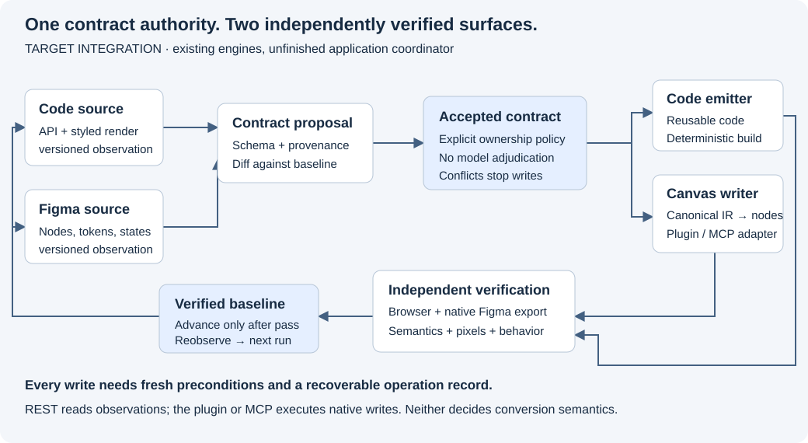

# React ↔ contracts ↔ Figma

**Public project status · updated 2026-09-21 · V1 is not complete.**

V1 targets React. Design System Contracts observes a team's original code or native Figma components, derives supported contracts and generates editable output through deterministic shared rules. Composed components, two-way updates and repeatable recovery are required outcomes. Lit/Web Components are parked for V1.1.

This page is the current acceptance ledger and work order, also rendered at `/system`. Start with the [user journey guide](USER-JOURNEYS.md) for installation and application steps, and the [React V1 scope](REACT-V1-SCOPE.md) for the required cohort. Earlier measurements remain evidence; they do not override current failures.

The historical Card source round trip also loses responsive sizing: its CSS
`max-width` was emitted as a fixed native width. The REST receipt now reports
native agreement separately from the two explicit source-contract mismatches;
it does not qualify lossless source recovery. See
[D.86](23-known-limitations.md#d86-a-fixed-native-width-cannot-recover-a-lost-css-maximum).

The current layout candidate carries complete per-variant primary-axis fill onto
frames and repeated generated child roots, with an explicit zero basis for equal
Figma allocation. The app-delivered Tabs archive now responds to Stretch in a
clean consumer. With explicitly supplied static fonts matching the source's
recorded names and weights, both variants pass the unchanged image limit on
white and black, and both root dimensions match exactly at 439 × 176 px. The
worst difference is 3.7404%; the earlier font-input failures remain preserved.
Font-byte identity, interactive Tabs behavior and live native validation of the
placement rule remain open ([D.111](23-known-limitations.md#d111-primary-axis-fill-can-vary-with-a-prop),
[D.112](23-known-limitations.md#d112-font-names-do-not-identify-font-bytes)).

## The whole loop

1. **Observe the original.** Pin the source or Figma identity, dependencies, fonts, states and actual rendered output.
2. **Derive a contract.** Carry supported properties, anatomy, tokens, layout and composition; name missing facts.
3. **Generate the target.** Use the shared emitters to produce native editable Figma or reusable React.
4. **Verify independently.** Compare structure, dimensions, pixels, editable content and declared behavior.
5. **Maintain the agreement.** Observe both sides against a shared baseline, apply supported changes, verify again and prove an unchanged repeat writes nothing.

The complete loop remains unqualified. Recorded matched-frame captures made with the original instrument did not inspect closed shadow content; the application names that limitation. The state-API Switch now also has a separate nine-pair recapture with shadow-boundary checks, shown alongside its unchanged original record. New recordings require the strengthened capture instrument ([D.79](23-known-limitations.md#d79-transparent-captures-must-inspect-closed-shadow-boundaries)).

## Where we are

| Area | Measured application outcome | Remaining gap |
| --- | --- | --- |
| React originals | The fixed shadcn cohort opens ten styled cases. A workspace declaration admits the independent Badge/Alert/Switch family; its seven cases validate. Radix Themes validates four cases against archived replay, both through its compiled package and a separately declared shipped-JSX workspace. A separate unmodified Separator cohort validates and traces both textless cases. | Arbitrary repository discovery is not supported. The compiled Radix workspace refuses native content ownership; the shipped-JSX workspace still refuses API/structure completeness ([D.76](23-known-limitations.md#d76-declared-jsx-entry-points-need-not-live-under-src)). |
| React → native Figma | The application creates simple, stateful and composed native output. Retained Button, Checkbox and Card objects have independent readbacks and bounded correction/repeat proofs. The declared Switch's nine states and composed Alert now have guarded source/native frame measurements visible in the app. | Badge has an exact-width mismatch; some historical Button scores remain above 5%; retained empty Button mains lack comparable pixels. Broader behavior, themes, responsive states and dependency internals remain unqualified. |
| Figma → installed React | Through app import and archive preparation, clean consumers measure Altitude Badge **10/10**, CBDS Badge **72/72**, Checkbox Group **12/12** and standalone Checkbox **26/26**, using the unchanged 5% limit on white and black. CBDS and Checkbox use explicitly supplied, hashed Inter and Public Sans assets respectively. | Tabs now retains observed body content, active styling and Stretch allocation; its unchanged app archive passes 2/2 image pairs with source-named static font inputs and exact root dimensions (D.112). Keyboard interaction and accessibility remain unqualified. The latest app-delivered standalone Tab retains pressed paint, its full focus border, per-variant tracking and all ten exact native root dimensions: **8/10** image pairs pass both backgrounds; unselected rest and pressed text remain at **12.56%** black difference ([D.93](23-known-limitations.md#d93-complete-observed-tracking-can-vary-by-prop)). Invalid tracking refuses; restoring the contract produces an identical archive. Normal reload and workspace selection restore the exact contract and delivery action. Earlier failed consumers remain preserved. Consumer fonts do not authenticate Figma font bytes. Broader semantics, accessibility and instance swaps remain unqualified. |
| Updates and recovery | Live code changes update existing nodes; exact repeats write nothing. Conflicting design edits refuse. The app detects design-only changes and verifies agreement after a developer changes the source. Begun-write recovery has a live canvas settlement and independent verification. The app now previews a real opacity edit, selects one source candidate and checks all ten configured examples: 60 initial states and ten interaction trials per source version across five caller contexts, including the nested Card. The reviewed change now applies to the original module and regenerated CSS through the app; all ten source examples and fresh pre/post canvas reads pass. Restart before the write resumes safely, and a repeated completed Apply request changes no retained files. Explicit restoration returns source/CSS byte-for-byte, validates all ten examples and preserves the full native snapshot. Later source and canvas edits each refuse before a source write and remain intact. | Bounded Apply, source restoration, live source/canvas conflict refusals, subsequent native succession and partial-file IO-failure recovery are measured ([D.108](23-known-limitations.md#d108-source-application-requires-fresh-canvas-reads-and-verified-recovery)). Completion requires fresh canvas reads, all-case source validation and demonstrated recovery; preview coverage is limited to configured callers and the recorded finite/action domain ([D.105](23-known-limitations.md#d105-source-repair-must-check-the-other-configured-callers)). Bound-size updates require narrow fixed-layout conditions; broader changes and full two-way acceptance remain unqualified. |
| Delivery | The local app produces React archives, records native operations and shows original/native comparisons. Installation and workflow guides name fonts, CSS Modules and current limitations. | The earlier engineering PR train and source-readiness #160 are merged; template #161 is in CI, and reviewed source-repair and composition changes still require qualified integration. Release qualification, tagging, publishing and deployment have not happened. |

**No complete journey cohort has met every V1 criterion.** Passing individual images or engine checks does not establish the full product outcome. The ledger below records the denominators, failures and evidence.

The retained Checkbox's fresh source observation exposed four newly requested
number tokens. The live app added them to the retained collection: independent
readback confirms all 46 original variables and all 44 nodes are unchanged,
with 50 variables afterward. The canvas was inspected with the companion closed.
A separate compiler review then corrected the twelve transparent hit-area shapes;
independent readback preserved every node ID, all variables and all twelve images
([D.103](23-known-limitations.md#d103-additive-token-allocation-is-a-separate-correction)).

### What the React application can do now

The `/sources` page loads the configured original workspace. **Validate React sources** checks source identity, authored styles, actual fonts and states against archived replay; representative negative controls reject missing or hidden content. **Inspect React APIs**, **Trace React structure** and state/callback inspection derive supported facts without substituting generated code for the original.

Root, initial-state and composed operations pin their plans before the companion executes. Independent readback checks the supported native structure, variables, main links and caller content. Repeat preparation reopens the same operation. Unsupported ownership, layouts or mappings remain named refusals.

**Prepare caller-content comparison** creates a separate native instance of an existing main with observed content. Reusable mains remain reusable. **Review recorded matched frames** shows authenticated Switch and Alert measurements on white and black at original pixel size, with exact source/native geometry checked separately from the image threshold. Preparing those capture records still requires operator scripts; displaying them in the app does not make capture automatic.

The declared Switch passes all nine matched-frame pairs (maximum **4.167% white / 2.399% black**); Alert passes at exactly 360 × 68 (**3.064% white / 3.100% black**). A separate native editing probe changes Switch variant properties and Alert caller text, then restores the exact original PNG and native properties. The source mains and verified comparison remain unchanged. This proves those edits remain available in Figma; it does not prove that these edits synchronize back to React. The retained Switch thumb still has an exact descendant-geometry mismatch. Fresh application observations now recover the transparent hit area, and a guarded correction updates all nine existing native rectangles in each of the initial-state and state-API sets to exactly −11, −7 and 54 × 32.390625 px. Independent readback and its unchanged repeat pass; all nine PNGs and export bounds remain byte-identical. The first resize attempt rolled back, and its separate baseline read now closes that failed write without losing its history. A source height change also changes the pseudo box, which a native height-variable edit alone does not reproduce ([D.85](23-known-limitations.md#d85-transparent-pseudo-geometry-needs-independent-box-evidence)).

**Inspect sizing details** records the native facts required for a bounded size correction. Through the app, the existing nine-state set now follows a source height change from 18.390625px to 20px: one shared variable changes nine roots, nine thumb positions and nine transparent hit areas. A separate readback verifies the result; unchanged review writes nothing. Restoring the source produces a verified reverse update with the complete original 29-node/30-variable observation and all nine PNGs restored exactly. Closing the companion before delivery and reconnecting resumes the same reverse request with one write. The first read-only preflight refusal is retained. This does not qualify lost-write recovery, broader layouts or the original thumb's exact geometry ([D.87](23-known-limitations.md#d87-pixel-dimension-value-history-does-not-authorize-a-bound-size-write)).

**Review compiler update** supports bounded corrections with a fresh preflight, guarded write and independent readback. **Read design changes from the canvas** reports supported differences on the tip of a correction chain. Source succession can retain an operation across a later sealed observation of the same case. Conflicts and uncertain write outcomes stop further writes until explicitly resolved.

### Build rules that compose

The contract records supported properties, anatomy, layout, tokens, content and component references. Readers and emitters use reusable rules; examples exercise those rules or expose a missing one. Runtime conversion requires no AI.

The composed Card delivery contains seven dependency components and six parent variants. Parent readback validates supported nested identities, state and slot content; dependency mains are verified by identity only. Deeper caller-content locations remain refused. Source-preserved React composition has separate browser behavior checks; neither result qualifies every composed journey.

Native component properties and editable slot text are different capabilities. Figma does not retain parent text-property bindings into instance slots. The writer refuses such mappings before allocation and represents supported caller text as native editable content. It does not expose an ineffective property control. See the [limitation ledger](23-known-limitations.md) for decisions and reversal instructions.

The application now derives the explicit root text-template marker from complete
direct-text observations. A fresh two-case capture authenticates painted fonts
and image bounds on all 200 property planes, preserving all 418 sealed files.
Through Sync Runner, its saved operation creates 100 reusable native mains,
153 source variables and 54 routing variables; independent readback verifies
all 302 nodes and the full variable graph. The unobstructed canvas was inspected.
Reusable mains keep empty editable content; this structure result does not
qualify their caller rendering.

The application caller still fails the 5% bar at **8.43%**: native width is
51.01599884 px against 49.921875 px in the original React source. Recorded-origin
diagnostics retain differing pixels outside text. The earlier engineering
comparison remains a separate 6.85% failure.

Canonical capture imported through the app preserves all 400 typography
references across 100 variants. Its downloaded archive installs unchanged in a
clean React consumer. With the original font supplied by that consumer, all
100 combinations match the original React dimensions, typography, paint,
spacing and corners; changing caller text updates every combination. Lossless
PNG comparisons now pass **100/100** on white at the unchanged 5% limit:
maximum antialiasing-aware difference is **0%**, while exact-pixel difference
reaches **29.39%**. All origins and dimensions match, and all isolated replays
are byte-identical. Both source-readiness cohorts now pass **50/50** with an
explicit web-font witness; each representative rejects all five corruption
controls, including same-family system fallback. All 200 source/replay PNGs
are byte-identical to those already scored. The earlier family-only refusals
remain archived ([D.101](23-known-limitations.md#d101-web-font-witnesses-reject-same-family-system-fallback)). A same-tab
reload requires manually selecting the saved Workspace import and produces
identical contract and archive bytes. One earlier return tab stalled; recovery
used a fresh tab with React output selected. Native fidelity, template updates,
interrupted native recovery and the complete independent-family journey remain
unqualified ([D.99](23-known-limitations.md#d99-native-root-text-templates-still-need-an-application-journey)).

Arbitrary React programs and CSS are not automatically convertible. A design drawing cannot supply business logic such as data fetching, sorting or validation. Existing behavior needs a verified preservation boundary; design-only behavior needs a declared, tested implementation.

### Lit and Web Components: paused for planned V1.1

The configured Altitude flow and its existing records remain in the collapsed Lit evaluation archive on `/sources`. Preserve its adapters, fixtures, captures and regression checks. React V1 does not require a Web Components journey; V1.1 is planned scope, not a release date or support claim.

## Plan and measures of success

| Order | Milestone | Required exit evidence | Current status |
| --- | --- | --- | --- |
| 1 | Verify React intake | Original styles, fonts, dependencies and selected states; broken inputs rejected. | Configured cohorts verified; arbitrary intake unproven. |
| 2 | Complete React → editable Figma | Simple, stateful and composed output; visual, structural and editability evidence; unchanged repeat creates nothing. | Partial live delivery; named visual and ownership gaps remain. |
| 3 | Complete Figma → reusable React | App-delivered archive installed in a clean consumer; fidelity and declared semantics measured. | Multiple measured sets; full journey qualification remains open. |
| 4 | Maintain an existing pair | Supported edits both ways; conflicts, interruption, recovery and repeat behavior demonstrated. | Bounded reviewed design-to-source Apply and native succession pass; broader updates and recovery remain open. |
| 5 | Prove generality and release readiness | Independent family completes both journeys without named-component fixes; accurate installation and limitations. | Independent-family gaps and sequential PR integration remain. |

### V1 acceptance evidence, 2026-09-21

The owner's React-only V1 asks for five demonstrations. Each row names what the application shows today, where the evidence is, and the concrete gap. None of these rows is a release grade.

A reviewed provisional-child candidate now retains corroborated static content from unresolved REST instances ([D.109](23-known-limitations.md#d109-observed-child-content-remains-provisional)). The running app imports the captured Tabs family, shows its previously missing body text, and prepares a seven-component package. A byte-identical archive installs in a clean consumer. The initial result still lost active styling, alongside the stretch, width and black-background fidelity failures.

A subsequent application import carries typed per-item enum choices from known child contracts ([D.110](23-known-limitations.md#d110-repeated-items-retain-known-child-enum-choices)). Its downloaded archive installs byte-identically in a clean consumer and restores the first tab's active appearance, but still fails at 5.24% and 5.78% on black, with discarded stretch behavior and a content-width mismatch. No additional acceptance row is complete.

| Criterion | Demonstrated through the application | Evidence | Concrete gap |
| --- | --- | --- | --- |
| 1 · React → contract → editable native Figma for simple, stateful and composed components | A separate three-state Checkbox journey now completes 96 source trials, 144 restorations, 96 preview trials and 96 returned-package trials. Its twelve native appearances pass both backgrounds with exact root geometry; all twelve native variant selections restore exactly. The first return lost stroked checkmarks (6/12 appearances); a fresh canonical capture with the generic stroked-path rule now yields an unmodified app package passing 96 behavior trials and 12/12 visual pairs with exact root bounds ([D.84](23-known-limitations.md#d84-open-stroked-paths-retain-their-centerline-and-parent-viewport)). Native polyline and curve creation, resize, edit restoration and unchanged repeat are measured separately. The failed first source experiment and manual polling intervention remain recorded ([D.82](23-known-limitations.md#d82-three-state-native-delivery-passes-appearance-but-the-return-loses-stroked-vectors)). A later experiment completes 96 trials and 144 restorations with normal Sources polling active and unchanged-repeat reuse; startup and terminal authentication remain slow ([D.83](23-known-limitations.md#d83-running-state-api-progress-cannot-certify-a-result)). Button (simple), Checkbox (stateful, 12 initial-state variants) and the composed Card graph (seven dependencies, six parent variants, 169 scoped variables) are created through the companion plugin from the verified shadcn cohort; the parent structure passes independent readback, including after Figma re-identified slot content and in a fresh live readback on 2026-09-18 after the verifier fix; same-day read-only readbacks of the retained Button family (191 nodes, 63 images) and the corrected Checkbox (44 nodes, 12 images) matched their last applied corrections without another write; a live title edit stayed local to one instance; repeat preparation created no duplicates; the app shows the unchanged original beside the native default variant. | `/sources` → composed Card → **Check native composition** → **Create and inspect native graph**; private operation journal `4e6e22c3…` and update journals `c620c0e9…` (Button) and `0b978ebf…` (Checkbox) in the Evaluations file. | Visual fidelity is measured, not graded: `npm run react:native:fidelity:check` recomputes three numbers per variant from the committed bytes in `recipe/evidence/react-native-fidelity-v1/` (44 pairs). Button initial states: 24 measured, 17 pass, 6 named font residuals, 1 named other (a white-trim threshold artefact), 0 fail. Checkbox initial states: 12 of 12 pass. Composed Card parent variants: 6 of 6 pass. Retained Card frames: 2 of 2 pass. The 63 retained Button mains are not measured as images: their content slots are empty while every original renders the label, and neither side records a layout origin. Their non-content box facts are compared without images instead: for each main the same check recomputes 19 facts (declared width and height, padding and border width per side, radius per corner, background and border paint, opacity, gap and shadow stack) from the sealed React property-matrix observation and the native readback values in `root-geometry/facts.json`, joined through the plan's property axes. Of 1,197 facts, 1,155 match exactly (numbers exact or float32, colours on the sRGB 8-bit grid), none mismatches, and 42 are not comparable because the dimension is content-derived on both sides: the width of 35 mains, and the height of the seven mains with `size` unset, which are 22 px tall in React and 3 px in Figma, where the slot is empty. The other 17 of the 80 source observations omit a property, render the same tree as the explicit default and have no variant of their own. The native plan was compiled from these same observations, so the table shows that measured values were carried to the canvas; it is not an independent second measurement, and it says nothing about width, text, fonts, antialiasing or any pixel. Across the 44 pairs the historical ink-trim score spans 0.000–9.195%, the layout-origin-aligned score 0.000–2.255%, and the glyph-masked score is 0.000% on every row it can measure (nine text-only Button rows leave nothing to mask). The seven historical Button failures (six at 9.04–9.20%, one at 6.17%) stay in the record. Recorded typography is identical on both sides for all 32 text-bearing pairs (weight, size, line height, letter spacing; the font Chromium actually used is recorded as Inter on 30 of them and was not recorded for the two retained frames), no above-tolerance pixel differs outside a native text box, and Chromium lays down 1.12–1.36× the ink Figma does for the same glyphs, so the residual is text antialiasing. These are antialias-tolerant scores, not pixel identity: exact-pixel difference runs from 5.7% to 99.3%, mostly one-step colour rounding. Still not measured: the pixels of the 63 Button mains (only their non-content box facts are compared), interaction, hover, focus, responsive and dark-scheme states; the owner has not graded any of it; dependency mains are verified by identity only; two-level caller content and deeper slot locations refuse by name; first-run latency remains too slow. |
| 2 · Designer-authored Figma → contract → working React in a clean consumer | **Measured through the local app in macOS Chromium on 2026-09-19 and 2026-09-20.** REST captures were loaded with the JSON file picker, restored and repeated without duplicate family IDs, then exported with **Prepare React library**. App archive bytes match the packages independently installed in isolated React consumers. At the unchanged 5% limit on both white and black: **Altitude Badge 10/10**, **CBDS Badge 72/72**, **Altitude Checkbox Group 12/12**, **Altitude Checkbox 26/26**. CBDS uses explicitly supplied, hashed Inter and D.90’s owned-leaf default: maximum differences 2.214% white / 4.557% black. Checkbox uses pinned Public Sans and D.88’s guarded root default: maximum black difference 3.279%. Both runs preserve native PNGs and exact root dimensions. Text and variant probes pass, and installed consumers plus source/before/after comparisons were inspected visibly. | Original captures, archives and receipts remain in `design-led-app-2026-09-19-D75s7P2Q/`. Fresh app deliveries: `native-text-app-20260920/` (Checkbox archive SHA-256 `938d86eb…a6e1d8`) and `cbds-owned-text-app-20260920/` (CBDS archive `96b35933…9dcd2a`), including font inputs, stable bracketing REST snapshots, repeat-import and visible-review evidence. Shared checker: `npm run design:consumer:check`; decisions and reversals: D.48–D.60, D.88 and D.90. | **Broader design-led acceptance remains incomplete.** The same Checkbox and CBDS app archives measured in Linux Chromium pass only **13/26** and **36/72** respectively; native PNGs, hashed consumer fonts and exact root dimensions match the macOS evidence. Linux fidelity remains open (`native-text-linux-20260920/`; D.88/D.90). Rendering-policy switches can change Linux glyph metrics; exact authored-policy tests do not qualify pixels. Altitude Tabs now retains observed child content, active styling and equal Stretch allocation. The same app archive with the source-named static font inputs passes 2/2 image pairs on both backgrounds and exact 439 × 176 px root dimensions (D.112); keyboard interaction, accessibility and source-font byte identity remain unqualified. The six historical CBDS outline failures (66/72) and Checkbox 13/26 result remain preserved; fresh packages pass without changing source designs, scorer or limit. CBDS repeat import retains identical contract bytes and all five current workspace entries; its app-copied inline export now parses and typechecks with its dependencies. Checkbox’s earlier repeat retained its then-current two entries. These results do not qualify keyboard behavior, accessibility or instance swaps. The checker uses full-bounds native exports, recorded browser origins and one common crop; earlier independent-crop evidence remains preserved. Font inputs authenticate consumer assets, not Figma’s font bytes; missing-glyph fallback remains possible. Packaging requires the local development server, CSS Modules and design fonts. Exact app-displayed download URLs yielded bytes equal to the server and installed archives; no browser save path is claimed, and the earlier Checkbox download event timeout remains recorded. No owner grade was written. |
| 3 · Updates both ways, conflicts, interruption recovery, duplicate-free repeats | **Original-source Apply, 2026-09-21:** the reviewed Checkbox disabled-opacity change now writes the original module and generated CSS through the app. All ten configured examples validate against the updated source; independent pre/post reads preserve the existing 44-node native set at float32 0.6. Restart before the write resumes with a new read; repeating the completed Apply endpoint leaves 69 source and retained operation files identical. Explicit restoration returns both source files exactly, validates all ten examples again and verifies the unchanged complete native snapshot. The unobstructed canvas was inspected after Apply and restoration. A later sealed application refuses an intervening source comment at the file-write boundary and a 70% canvas edit to four nodes at fresh preflight; both conflicts remain intact, with no source-written event (`live-conflict-v1/`). Evidence: `private/react-design-source-repair-20260921/live-apply-v1.json`, `live-apply-repeat-v1.json` and `live-apply-restore-v1.json`; [D.108](23-known-limitations.md#d108-source-application-requires-fresh-canvas-reads-and-verified-recovery). **Bound-height update, 2026-09-20:** retained state-API set `62e0264f…` changes 18.390625px → 20px and reverses through the app, including derived thumb movement and hit-area correction. Both independent readbacks pass; repeats write nothing. A before-delivery interruption resumes with one write. The original 29 nodes, 30 variables and nine PNGs restore exactly. Evidence: `private/bound-cross-size-20260920-1656/application-update-v1/`; [D.87](23-known-limitations.md#d87-pixel-dimension-value-history-does-not-authorize-a-bound-size-write). **Live on 2026-09-18, through the app and the companion in the Evaluations file, on the existing twelve-variant Checkbox set.** *Code-only change:* editing the original source (`disabled:opacity-50` → `-40`, stylesheet rebuilt) no longer orphans the native component. A recorded **source succession** lets the existing operation follow a later sealed observation of the same case; **Review compiler update** then proposed 0.5 → 0.4 on the same four existing nodes, the canvas showed 40 %, and two independent readbacks agreed. Restoring the source byte-for-byte produced the reverse change on the same nodes. An intermediate revision whose stylesheet had not been rebuilt was observed truthfully (0.5 → 1) and not applied. *Same-channel conflict:* a designer's 80 % on one of those nodes refused the write at preflight by name (`native-update-opacity-conflict:<node>`); no write claim was created. *Interrupted write:* the app was killed at the instant of write dispatch. After restart the write was not re-sent; **Resolve by reading the canvas** found the nodes untouched, and a second write under its own numbered claim was independently verified. In that run the second write followed automatically; an adversarial review of the change showed that a second or stalled companion could then execute both writes, so the rule was tightened before merge: the companion must now ask the app before executing any write and is refused once a canvas read is judging it, an untouched write stops and waits for an explicit operator decision before a new one is sent, and a write that had begun is never treated as dead. *Repeat:* reviewing, preparing and inspecting again planned nothing, reopened the same operation and wrote nothing (one write in the journal). *Design-only change:* a designer set the four disabled variants to 60 % in Figma. **Read design changes from the canvas** named exactly those four values (0.5 → 0.6) while the update stayed verified and nothing was written. After the developer changed the source to render 60 %, the same update path found both surfaces in agreement: the write program reported `no-op` with nothing changed, the independent readback verified 0.6, and the shared baseline advanced with zero canvas writes. Source and canvas were then restored. The separate state-API Switch also now demonstrates source opacity 0.5 → 0.4 → 0.5, unchanged-repeat review, a one-node conflict refusal and retry of the same correction; all native metadata and source bytes restore exactly ([D.73](23-known-limitations.md#d73-state-api-operations-follow-fresh-source-evidence-without-replacing-their-native-set)). | Private journals `27f378de…` and `ea0e4d6d…` under `private/source-native-updates/`, succession journal under `private/source-native-successions/`, index `private/two-way-live-2026-09-18/README.md`; rules and regressions in `source-reference/native-source-succession*.ts`, `native-update-write-outcome.test.ts`, `core/native-contract-update.test.ts` (float32). | **Original-source Apply is measured only for the reviewed root-opacity channel.** Subsequent native succession now retains the existing set: one owned variable changes to 0.6, all 44 node snapshots and twelve PNGs remain exact, and unchanged review writes nothing (`native-succession-v1/`). A real partial-file IO failure now resumes through the app: the installed module is retained, CSS completes, a recorded capture-control failure refuses completion, and a fresh retry writes nothing before passing all ten source examples and final native verification. Explicit source restoration and reversal of the four temporary canvas edits return both source files and the full native snapshot exactly (`partial-write-v1/`). Process termination during file replacement remains unmeasured. A separate manual native-height edit → canonical capture → app import → React archive replacement is now measured on the existing state-API Switch: nine updated 32 × 20 px roots pass both backgrounds (maximum 2.662% white / 2.083% black), and the original consumer passes 54/54 state/callback trials after upgrade and again after rollback without source edits. Only the archive’s height token changes. Native snapshots, bindings and ten PNGs restore exactly; npm normalizes one equivalent local archive path in the consumer manifests. This does not qualify automatic repair or source-to-native bound-height updates ([D.72](23-known-limitations.md#d72-a-native-height-edit-returns-as-a-package-update-without-changing-the-state-api)). Outside the bounded reviewed root-opacity channel, the developer edits the hand-written React; the tool reports the designer change and checks agreement. That read exists only on the tip of a correction chain, not yet on an operation that has never been corrected. Updates cover only the bounded correction channels (opacity, literal dimensions on empty flex roots, root shadow stacks, simple SVG strokes, background layers); any other source difference refuses by name. Root families seal a content-derived component name at observation time, so an edit to a root's own matrix refuses (`bound-token-change-unsupported`); initial-state sets compile under the existing identity. Re-reading a *parent* operation after a written correction used to break that operation's correction chain; the app now refuses that read by name (`react-parent-observation-superseded-by-correction`) and points to the latest correction instead. The Button root family was re-read before that guard existed, which stranded its correction chain. The app now recovers the exact pinned parent prefix while validating the entire current journal, and requires a fresh correction read tied to the current parent before reuse. Live **Inspect update again** restored verification: 191 node snapshots, token data and 63 PNGs match the prior result, with one historical write and no repeated write. The parent journal is unchanged; later reads remain evidence. See [D.64](23-known-limitations.md#d64-a-later-parent-read-must-not-strand-a-verified-correction) and private `native-parent-baseline-recovery-tsv6lvyo/`. This restores the supported correction path; broader repair channels remain unqualified. This run also exposed and fixed a write defect: a value float32 cannot hold exactly (0.4) was written correctly, then misread as a conflict. *Landed-write recovery shown live on 2026-09-19:* Switch update `b5b224ff…` was interrupted after its real `begin`, the companion closed, and the operator attested through the application. Reopening replayed a saved result after revocation; the app kept it as evidence only. **Resolve by reading the canvas** found the same three disabled nodes and owned variable at float32 0.4, and a separate read verified the correction. Late delivery does not prove the old companion was alive at attestation time; the review copy now says so (AGENT decision and reversal in §B.40). Evidence: `private/begun-write-recovery-2026-09-19-kg6h29ab/`. The untouched and late-execution interleavings remain synthetic. If the companion was granted permission to begin a write and then died, an operator can now say so. **Attest the companion is gone** (`…/update/<proposal>/attest-dead`, POST with no body) records `update-attempt-attested-dead` (attempt id, the fixed operator statement, time). It is accepted only when the latest write was begun and is unresolved and no companion for the update has polled in the last 15 seconds; the page also waits a minute after `begin`. Otherwise it refuses by name (`native-update-attest-dead-no-write`, `-write-not-begun`, `-write-answered`, `-observation-in-flight`, `-write-settled`, `-companion-connected`). Attesting the same unsettled write again records nothing. The attestation revokes that attempt, so a later `begin` is refused. A later result is kept as `late-result-after-revocation` and never counts as the outcome. Before the settling read it is evidence only. After the read it is judged by the same allow-list as any late write result: a result that contradicts the read stops the update (`native-update-late-write-result-contradicts-canvas`). A canvas read dispatched after the attestation settles the write exactly as for a write that never began: untouched waits for **Preflight again and send a new write**, completed continues to verification, anything else stays `update-recovery-required` by name. The correction chain unfreezes. **Residual risk, stated plainly:** revocation is app-side. The app cannot stop a companion that is in fact alive and already past `begin`: its pinned program can still execute after the settling read. That program is guarded and idempotent. It writes only over the exact saved or proposed values, so over a verified canvas it is a `no-op` and over a designer's edit it refuses. If it writes without reporting after an untouched settlement, it is detected only if the operator re-arms: the first later preflight that actually reads the canvas names `native-update-canvas-moved-after-revoked-settlement`, including a preflight that refused. Without a re-arm nothing in this operation detects it. If it lands between the re-armed write's preflight and its execution, both programs write the same values, the re-armed write is a `no-op`, and the update verifies; that interleave is benign. A canvas-side revocation token was considered and rejected (reasons in [docs/23 §B.40](23-known-limitations.md#b40-a-revoked-update-write-can-still-execute-late)). Tests: `source-reference/native-update-write-outcome.test.ts` and the actual companion in `native-update-jobs.test.ts`. The synchronous native listing still blocks other app requests while it is read. Response-scoped reuse reduced a read-only probe of the retained shadcn history from 32.7 to 17.4 seconds with byte-identical output; the independent-family listing changed from 7.8 to 7.0 seconds. A later 112,792-byte independent-family history measured 11.59/11.55 seconds before and 9.71/9.84 after reusing plain failed reads within the same response, with identical output. These are individual local measurements, not a latency guarantee or a new companion timing result ([D.65](23-known-limitations.md#d65-native-review-reuses-evidence-only-within-one-response)). A value change to an owned, allocated number variable is carried only after the current document-wide binding and alias guard passes ([D.74](23-known-limitations.md#d74-variable-updates-inspect-document-bindings-before-writing)): the same guarded update writes the variable's value by its pinned id together with the literal changes, and any other token change still refuses by name (`native-update-bound-token-change-unsupported` only when something is bound). **Shown live on 2026-09-19 on the independent family** (Switch initial-state operation `a9e6d704…`, nine variants, Evaluations file): the developer changed `data-disabled:opacity-50` to `opacity-40`; before this rule the review refused `native-update-bound-token-change-unsupported:changed;…root.opacity.true` although nothing was bound. With it, one proposal carried three variant literals and variable `VariableID:81:795` 0.5 → 0.4; the companion ran preflight → `begin` → write (`updated`, 3 nodes + 1 variable) → independent readback 0.4000000059604645 on all four → `update-verified`. A second review planned and wrote nothing (no new plan or journal file). The source was then restored byte-exactly and the reverse proposal carried all four back to 0.5, returning the variable to its allocated value → `update-verified`. Evidence: `private/independent-family-update-2026-09-19/README.md`. That historical write used a page-only check and cannot authorize another variable write. **Current guard shown live on 2026-09-20:** a consumer on another page made preflight refuse before any apply claim (64 pages / 1,468 nodes), with both owned pages, 30 variables and 19 PNGs unchanged. After removing the three probe nodes, the same proposal scanned 63 pages / 1,465 nodes, changed only three disabled literals and their owned variable 0.5 → float32 0.4, and independently verified the result. Restoring the source produced a verified reverse update to 0.5; all source bytes, native snapshots, bindings and 19 PNGs restored exactly. The refusal remains immutable history. Hidden-instance, text-range, style, vector, alias, unavailable-scope and oversized-document cases remain synthetic adversarial coverage. Historical programs retain their exact bytes; old pending or begun variable proposals cannot obtain new write authority. Evidence: `private/document-binding-live-lwtcu999/`; scope and reversal: D.74. This run also fixed cohort-anchor selection for stateful source succession, recovered the original callback evidence without dropping its refusals, and verified refreshed evidence through a zero-property `no-op` with identical 29-node readback, token data and nine main PNGs. A subsequent unchanged review reused it with all 269 plan/update/succession files byte-identical ([D.75](23-known-limitations.md#d75-stateful-source-identity-does-not-depend-on-the-archive-anchor)). |
| 4 · An independent component family without component-specific fixes | A declared shadcn Badge/Alert/Switch workspace completes source validation and structure observation (7/7), with native creation through the app using shared rules. The app also demonstrates a bounded generated Switch consumer: 54 source-matched input/action trials, live initializer changes and caller-held versus accepted callbacks. | `recipe/evidence/react-native-declared-family/`, `react-native-matched-capture/` and `react-native-matched-content/` retain authenticated native evidence; `npm run react:native:declared:check` recomputes it. Private app journals: `independent-family-2026-09-18/`, `independent-native-return-qz7pgw9f/`, `native-editability-o9ymb37r/` and `callback-candidate-isolation-nmtqn4yw/` and `stateful-native-return-1e6l8my3/`. | **The complete independent family remains unqualified.** Switch: nine app-created editable mains have exact 32 × 18.390625 roots. Guarded matched frames pass 9/9 on both backgrounds (maximum 4.167% white / 2.399% black); the app review is visible and native variant edits restore byte-identical snapshots and images ([D.62](23-known-limitations.md#d62-guarded-matched-frames-preserve-source-phase-and-original-evidence)). Native capture → app import → prepared React archive → isolated consumer preserves those nine root sizes and independent state maps after shared fixes ([D.66](23-known-limitations.md#d66-returning-native-fixed-controls-preserves-dimensions-and-independent-axes)); a separate matched-frame check passes 9/9 (4.167% white / 2.273% black). Standard layout-only capture still refuses shadows. The retained thumb remains unqualified. Both the initial-state and separate state-API operations now have all nine hit areas corrected exactly, independently verified twice, with unchanged PNGs ([D.85](23-known-limitations.md#d85-transparent-pseudo-geometry-needs-independent-box-evidence)). A fresh state-API cohort created through the app also has nine exact hit areas, confirmed by two application reads and a separate Console read; repeat preparation allocated nothing, and both earlier sets stayed unchanged. This does not qualify its thumb geometry or full visual/behavioral journey. The source-state experiment passes 54 activation trials with 81 exact restorations and repeat reuse; nine excluded inputs and three broad refusals remain explicit ([D.67](23-known-limitations.md#d67-callback-inspection-retains-restored-candidate-refusals), [D.68](23-known-limitations.md#d68-a-separate-check-observes-simultaneous-state-inputs)). The generated app preview passes all 54 trials ([D.69](23-known-limitations.md#d69-observed-boolean-state-inputs-project-into-the-existing-toggle-model)). A separate app state-API operation now completes native creation, independent readback, canonical capture, app import, archive preparation and clean installation ([D.71](23-known-limitations.md#d71-a-separate-app-operation-preserves-the-observed-state-api-through-native-return)). Its installed React consumer matches all 54 source trials, including live inputs, disabled behavior and callback values. Native instance edits restore identical properties and image bytes. Fresh matched frames pass 9/9 in each direction at the same maxima quoted above; exact descendant geometry and hover/focus/dark/responsive states remain unqualified. This same state-API operation now completes a guarded source-opacity update, named same-channel conflict, retry and exact rollback without replacing its native set ([D.73](23-known-limitations.md#d73-state-api-operations-follow-fresh-source-evidence-without-replacing-their-native-set)): three root values plus one owned unbound variable, fresh 54-trial experiments, unchanged-repeat review, and exact restoration of two pages, 30 variables and 19 PNGs. Broader live updates remain unqualified. A subsequent manual native height edit returns through the app as a same-API package update; nine updated images and 54 source-matched trials pass, including same-consumer replacement and rollback ([D.72](23-known-limitations.md#d72-a-native-height-edit-returns-as-a-package-update-without-changing-the-state-api)). A separate retained state-API set now also completes the guarded bound-height update and reverse in D.87; historical operations require fresh sizing facts before this path is eligible. Alert: guarded 360 × 68 frames pass 3.064% white / 3.100% black; caller text is editable and restores exactly, but caller sizing and deeper composition remain bounded. Badge: exact-size refusal remains, 43.875 px source versus 44 px native; fixing native text width clips content and was rejected ([D.63](23-known-limitations.md#d63-native-auto-width-text-and-fractional-source-width)). The declared family shares shadcn styles with the built-in cohort. A second code-led library, Radix Themes, validates 4/4 sources but all native drafts refuse content ownership. A separate explicit shipped-JSX intake also validates 4/4, but API inspection remains incomplete and structure tracing matches 0/4 before any native preparation; all existing native journals remain unchanged ([D.76](23-known-limitations.md#d76-declared-jsx-entry-points-need-not-live-under-src)). A separate Radix Separator cohort now validates and traces **2/2** cases through an explicit text-absence witness; all five applicable corruption controls reject. Native generation still refuses unresolved child ownership, with all 1,244 prior native journal files unchanged ([D.77](23-known-limitations.md#d77-textless-originals-require-an-explicit-absence-witness)). The CBDS design-led app journey now passes 72/72 on both backgrounds (row 2); this does not qualify its reverse journey or the independent code-led family. No component-specific converter or threshold change was introduced. |
| 5 · Installation, current documentation, supported limitations, acceptance evidence | [User journeys](../docs/USER-JOURNEYS.md) documents installation, import, local React archive preparation, fonts and CSS Modules requirements. [React V1 scope](../docs/REACT-V1-SCOPE.md) and the limitation ledger define supported paths and refusals. This table records measured app outcomes and remaining gaps. | `npm run docs:check`; the private live evidence named in rows 1–4; source-workspace instructions in `source-reference/README.md`. | Automatic discovery of arbitrary React repositories remains unproven. Radix Themes 3.3.0 Button and Switch matched their original renders, **4/4**, with five negative controls rejected per representative, but every native root refused `react-root-visual-source-content-unqualified` (private `radix-app-2026-09-19-qzxluzxc/`). The earlier engineering PR train and source-readiness #160 are merged. Native text-template integration is merged in #161; reviewed root-opacity source repair is merged in #162 after local validation, adversarial review and green hosted CI. V1 is not release-qualified until the independent-family and other named acceptance gaps close. |

The latest independent code-led extension is the React DaisyUI root-text-template
journey summarized above and in [D.99](23-known-limitations.md#d99-native-root-text-templates-still-need-an-application-journey).
The application creates 100 editable native mains with independently verified
variables and structure. Its returned package now preserves text styling and
passes all 100 original-versus-returned React image pairs on white. This closes
the earlier missing-text-binding return defect described in D.98.

The native caller's baseline still fails at 8.43%. A live source-color update now
passes independent verification on the retained mains and caller; interrupted
template recovery and full visual qualification remain unfinished. The full inherited source API is incomplete;
Radix content ownership remains a separate refusal. This does not close the
independent-family requirement. Earlier missing paint, typography and sizing
results remain preserved in their private journals and limitation entries;
they are not the current returned-package result.

The app now also creates a new caller after a verified source update and
independently verifies its link to the retained main, native slot and text.
Native text editing and visible restoration were demonstrated. The next
combined update must include both callers and independently confirm the
restored instance; that lifecycle remains unfinished. The new comparison
still measures 49.92 px source versus 51.02 px native width ([D.115](23-known-limitations.md#d115-caller-source-succession-preserves-the-mains-original-provenance)).

A separate foundation plans template token changes and verifies current
component values while retaining the original allocated identities. An
engineering writer now rechecks the complete component and document-wide
consumers synchronously before assigning existing variable values. Its tests
cover interruption, stale retries, intervening edits, unchanged repetition
and reversal. Existing caller observations now admit only their verified
instance subtrees; missing records or intervening caller edits refuse. A live
read-only preflight passed for five main variants and their recorded caller,
with independently verified unchanged observations and no assignments.
An independent read command now observes the component and all recorded
callers together, including partial value states; it also passed against the
retained native set without writes. Its diagnosis distinguishes unchanged
evidence from supported structure and grants no recovery or settlement
authority. A compact proposal restores the same guarded program while avoiding
repeated parent evidence in each caller record.
An exact value-propagation check now verifies selected native scalar, paint
and font changes while preserving every other recorded field. Changed computed
geometry remains a named refusal. In a live engineering run, one existing
color variable updated five main variants and their retained caller; the
separate read passed, and a guarded reverse update restored all 302 main node
records, five caller records and the caller image exactly. This used a synthetic
source successor, so it is not an application update or a fidelity result.
The application journal reader now inventories retained template callers from
fully validated operation histories, including their current journal revisions.
It refuses pending or unverified callers, changed parent identities and corrupt
history. Written updates can retain an original observation only while the
complete later journal remains valid and read-only. A read-only check loaded
the retained application's 302-node main and five-node caller; this inventory
does not authorize delivery or qualify an update.
An application adapter now connects fresh desired graphs and authenticated
caller history to compact update proposals, existing transport and independent
combined readbacks. It admits color changes while refusing geometry-affecting
changes before delivery. Journal/companion tests cover forward update, unchanged
repeat, exact reverse, caller-context refresh, conflict and lost-write settlement
across restarts. Updated main and caller exports are available in the review;
an intervening edit during export refuses the observation. Template-to-original-source
repair remains unavailable; the existing opacity repair path is kept separate.
Those interruption and recovery cases remain synthetic native-host coverage.
A real source-color change now passes validation and structure tracing, follows
the existing component, and updates 11 existing color variables through the
application. The independent read verifies all 302 main records and five caller
records with no other differences, retaining the same nodes and variables.
The unobstructed Evaluations canvas shows the blue caller, and the application
shows the completed update. Its source-to-native fidelity has not been remeasured.
The earlier identity refusal remains preserved: the SDK resolves the saved and
current caller text IDs to the same object. New proposals admit that transition
only with a complete slot-allocation proof and fresh SDK lookup equality; other
content, geometry, binding and ownership changes still refuse. Historical
proposal programs retain their exact bytes.
An unchanged review before delivery produced zero changes. Live repetition,
conflict, interruption, recovery and reverse delivery for this template path,
additional caller creation after an update, comparison refresh/repair transitions
and visual/layout qualification remain unfinished. Private evidence:
`native-template-app-integration-20260921/` and
`native-template-caller-identity-20260921/`.

Conversion stays deterministic and needs no AI at runtime: readers, compilers, writers and verifiers are pure functions of authenticated inputs, and every result above is reproducible from its recorded evidence.

**AGENT decision — variable-update preconditions, 2026-09-20.** New variable
proposals load every page and, after the last asynchronous read, check live node
bindings, text ranges, local styles and all local variable aliases without
pausing before assignment. Unavailable scope or more than 10,000 nodes refuses.
A live cross-page consumer refused before any apply claim; removing it allowed
the same proposal to update and reverse with exact restoration. Historical
page-only programs stay byte-identical evidence and cannot receive new variable
write authority. See [D.74](23-known-limitations.md#d74-variable-updates-inspect-document-bindings-before-writing)
for measured scope, residual risk, adversarial coverage and safe reversal.

### React V1 acceptance surface

These are requirements to verify, not a list of features already qualified:

| Capability | Required evidence |
| --- | --- |
| Layout and styling | Supported sizing, alignment, spacing, typography and paint preserve their meaning; original and target renders are independently compared. Unsupported CSS is named. |
| Tokens and themes | Token identities, values, aliases and supported modes survive conversion and edits. |
| Properties and state | Text, enums, booleans and omitted values retain their semantics; declared interactions are tested separately from appearance. |
| Content and composition | Nested identities, parent-to-child property mappings, editable text, named slots and supported instance choices survive. Include a table, form or dialog-scale composition. |
| Delivery and maintenance | A clean consumer installs generated React; Figma output remains editable; authorized updates work both ways; conflicts, interruption, rollback and unchanged repeats are verified. |

Do not expand every property combination blindly. Cover each supported rule, its known interactions and representative compositions, then exercise an independently selected cohort. If a combination is unverified or unsupported, report it. A component-specific exception does not establish a general rule.

For every milestone, report:

- **Outcome:** what a user can now complete, through which interface.
- **Coverage:** selected components, states, themes and composition features, including failures and refusals.
- **Fidelity and usability:** original and target renders plus independent semantic, structural and editability checks.
- **Manual intervention:** setup, mappings, scripts or repairs still required.
- **Reliability:** changed inputs, missing prerequisites, conflicts, interruption and repeat behavior.

Do not tune source styling or comparison thresholds to make a candidate pass. Native Figma evidence must come from actual native nodes, not an HTML imitation. Preserve existing signed evidence and leave release approval to the owners.

## Architecture and boundaries

The contract records supported semantics: identity, properties, anatomy, token references and modes, layout, content/slots, component references and declared behavior. Rendering representations are projections of that contract. They do not become competing sources of truth.

Code-led contracts may retain an immutable reference to a host-verified original runtime. Only qualified editable channels may alter that runtime; preservation does not make every design edit effective. Design-only observations cannot supply undeclared business logic or authorize executable dependencies.

| Connection | Responsibility |
| --- | --- |
| Figma REST | Read file/node observations for imports and drift checks. |
| Companion Figma plugin | Execute the shared engine's native operations and return observations. The development plugin connects to the local app on port 5181 using an operation-specific capability; native qualification is still pending. |
| Figma MCP / Desktop Bridge | Engineering access for native execution and screenshots. A successful engineering probe does not prove the application journey. |
| CLI and local application service | Invoke the same deterministic readers, compilers and verification logic; retain operation state. |

The paused Lit source workflow uses a configured sibling library. Each run must check the actual source and dependency identities; old captures do not establish current-source parity. Engineering writes are limited to Scratch and the user-provided DS Contracts Evaluations file. Existing operations remain bound to their original file; a new target requires a new operation identity. Altitude and CBDS remain read-only references.

### Implementation map

| Responsibility | Existing implementation to reuse |
| --- | --- |
| Browser engine imports and emitters | `playground/vite.config.ts`, `playground/src/engine/emitters.ts`, `core/index.ts` |
| React and Figma contract proposals | `playground/src/engine/code-import.ts`, `playground/src/engine/figma-import.ts`, `extract/figma/rest/fetch.ts` |
| Contract-to-Figma programs | `core/emit-figma-script.ts` |
| Canonical recipe canvas IR and writer | `recipe/figma-ir.ts`, `recipe/figma-writer-runtime.ts` |
| React source intake, paused Lit workflow and reusable observation infrastructure | `source-reference/`, especially `source-reference/compile.ts` |
| Application-owned source candidate jobs | `source-reference/service.ts`, `source-reference/candidate-jobs.ts`, `source-reference/candidate-run.ts` |
| Verified evidence selection and candidate inventory | `source-reference/binding-jobs.ts`, `source-reference/candidate-report.ts`, `source-reference/button-candidate-semantics.ts` |
| Unaccepted source-owned visual candidate | `source-reference/source-bound-anatomy.ts`, `source-reference/source-visual-seed.ts`, `source-reference/source-visual-contract.ts` |
| Verified original runtime preparation and React lowering | `source-reference/runtime-artifact.ts`, `core/runtime-emission.ts`, `core/emit-react.ts` |
| Runtime identity preservation and adoption refusal | `core/runtime-reference.ts`, `packages/core/src/contract-provenance.ts` |
| Actual plugin host | `figma-sync/plugin/engine/entry.ts`, `figma-sync/plugin/code.js` |
| Drift classification and merge computation | `core/channel-diff.ts`, `core/three-way-merge.ts` |
| Observation, baseline ledger and plan-only coordinator | `sync/observe.ts`, `sync/ledger.ts`, `sync/spine.ts` |

## How drift must be detected and repaired

Compare fresh code and canvas observations with the last mutually verified baseline.

- **Neither changed:** report a verified no-op.
- **One changed:** propose its supported changes and apply only under recorded authority.
- **Both changed:** combine compatible edits; report unresolved same-channel conflicts.
- **Inputs became stale:** reobserve and replan before writing.
- **Execution failed or was interrupted:** preserve operation and target identities; recover or roll back owned changes under checked preconditions. Do not advance the baseline on partial success.
- **Evidence is unavailable:** report the missing source, font, asset or connection. Unknown state is not synchronized state.

These are required product behaviors. The full loop remains unqualified.

## Keeping the public status current

Every pull request should state the user-visible outcome, validation, remaining limits and next milestone step. Update this page when usability, coverage or milestone status changes; say explicitly when a change improves internal machinery only. A merge does not imply deployment or a published package.

Keep the README focused on the product and present usability. Keep detailed experiment logs, handoffs and superseded working narratives in the gitignored `private/` archive. Reproducible fixtures, CI inputs, public technical references and signed evidence remain with their checks; housekeeping must not break reproducibility or rewrite grades.

When resuming work, read this page, [AGENTS.md](../AGENTS.md) and [CONTRIBUTING.md](../CONTRIBUTING.md), then verify the current worktree, source and PR state. After two attempts without new evidence, diagnose and replan.

### Checking these pages

`npm run docs:check` validates public claims and links. `npm run test:playground` includes canonical-document integration checks. `npm run site:build` builds the documentation site. The desktop/mobile documentation smoke test is `npm run test:product-overview:browser` with local servers on ports 5181 and 5182. These checks validate documentation surfaces, not conversion readiness.
